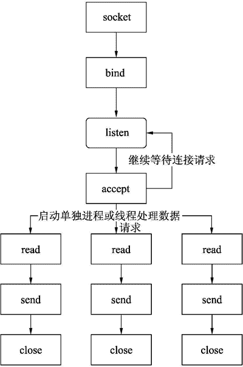
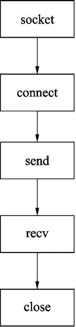

# Socket 是什么

> 原文：[`www.weixueyuan.net/a/714.html`](http://www.weixueyuan.net/a/714.html)

通过前面的介绍，是不是觉得 TCP/IP 很复杂，我们其实不必去完全了解这些协议的内部细节，因为对于多数用户来说，所关心的是如何使用这些协议来传输数据。

本节将介绍一套历史悠久的接口——socket。使用 socket 我们就不用直接和这些协议打交道了，也不用了解这些协议的很多细节了。这套接口在很多操作系统上都被支持。也就是说，你的代码如果使用的是 socket 接口，那么在绝大多数操作系统中都是可用的。

> 虽然不同操作系统会有不同的 TCP/IP 协议的实现，但是它们都提供 socket 接口。

socket 最初是伯克利加州分校在 20 世纪 70 年代在 UNIX 系统上实现的，当时各种类型的接口都被开发出来，但是到现在仅 socket 存活了下来。当时的 socket 接口是使用 C 语言实现的，我们以后使用的基本都是 Python 版的 socket。不过它们的使用方式基本一样。

socket 接口主要包括以下几个：

*   socket()：创建一个 socket。
*   bind()：绑定到本地指定的 IP 和端口。
*   listen()：等待远端的连接请求。
*   accept()：接受远端的连接请求。
*   connect()：给远端发起连接请求。
*   send()：给远端发送数据。
*   recv()：读取远端发送的数据。
*   close()：关闭 socket。

socket 分为服务器端和客户端，就是我们常说 C/S 结构，C 是客户端，S 是服务器端。服务器端一般是等待客户端的连接请求，接收连接请求，读取用户的数据请求并发送客户端需要的数据；客户端则是发起连接请求，发送请求数据，接收服务器端的数据并进行处理。

如图 1 所示为服务器端代码的基本结构。

图 1 TCP 服务器端的基本工作流程
在图 1 中，listen 返回时表示接收到了用户发起的连接请求。由于服务器需要给很多的客户端提供服务，所以一般情况下需要启动多个线程或者进程，这样在处理当前用户请求时还能继续对其他用户进行服务。所以可以看到在 listen 后使用 accept 来接收新的用户连接请求，然后启动一个新的链，该链包括 read、send、close 等操作。在启动这个链之后，当前进程直接返回到 listen，等待新的连接请求。

客户端相对来说比较简单。图 2 所示为一般情况下客户端的代码流程。

图 2 TCP 客户器端的基本工作流程
在图 2 中，首先申请一个 socket，然后连接到服务器上，连接成功后（也就是服务器调用了 accept 之后）就可以发送请求数据，最后等待服务器返回处理数据。如果没有更多需要处理的数据就可以使用 close 来关闭 socket 并释放资源。