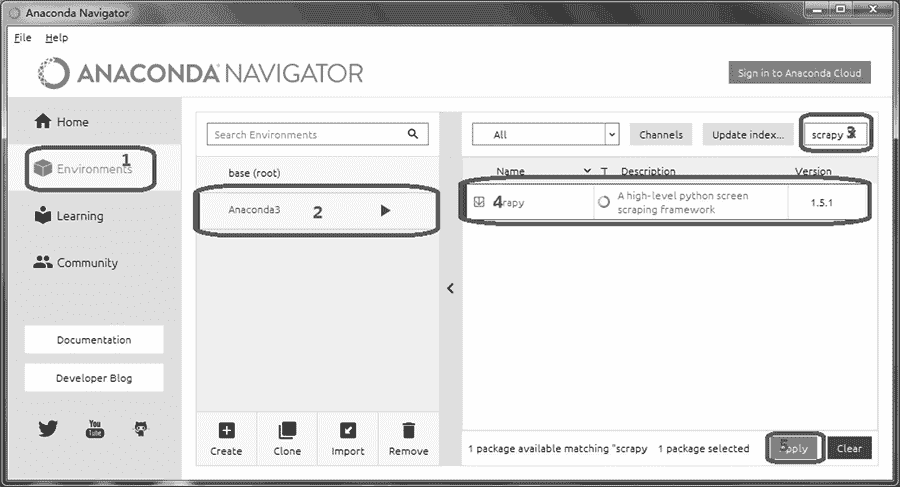
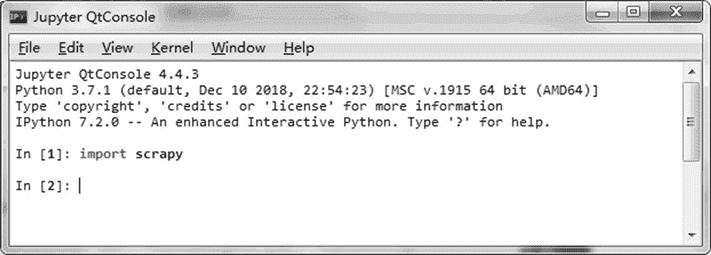

# Scrapy 安装（针对不同平台）

> 原文：[`www.weixueyuan.net/a/728.html`](http://www.weixueyuan.net/a/728.html)

Scrapy 是用 Python 实现的爬虫应用框架。

Scrapy 经常被应用在数据挖掘、信息处理等方面。可以使用 Scrapy 框架通过添加很少的代码来实现一个爬虫，达到提取某个网站或者某组网站的相关格式化的数据。

Scrapy 最初是为了页面抓取所设计的，但是也可以应用在获取 API 所返回的数据（例如 Amazon Associates Web Services）。作为通用的网络爬虫，其具有以下特点：

*   使用简单，功能强大；
*   易于扩展，速度快；
*   支持 Windows、Linux、macOS 等多个平台；
*   提供数据提取功能，支持 CSS 和 XPath 两种表示法；
*   异步工作方式；
*   可以输出 csv、xml、Json 等多种格式。

和其他软件包的安装一样，可以通过 PIP 来安装 Scrapy。如果是在 Linux 或者 macOS 环境下，输入下面的命令：

$ sudo pip3 install scrapy

如果是在 Windows 环境下，需要先安装包 pypiwin32，然后安装 Scrapy，输入下面的命令：

C:\> pip3 install pypiwin32
C:\> pip3 install scrapy

> 对于 Windows，推荐使用 Anaconda 来安装。

图 1 演示了基本的安装过程。

图 1 使用 Anacconda 安装 Scrapy
具体安装过程如下：

*   在左侧面板选择 Enviornment 选项。
*   在中间面板中选择工作环境，这里选择 Anaconda3。
*   在右侧面板的文本框中输入 scrapy。
*   选中查找到的项目 Scrapy。
*   在右下角单击 Apply 按钮，启动安装过程。

安装完成后启动 IPython，输入 import scrapy，如果出现下面的内容，表明安装成功，如图 2 所示。

图 2 检查 Scrapy 是否安装成功