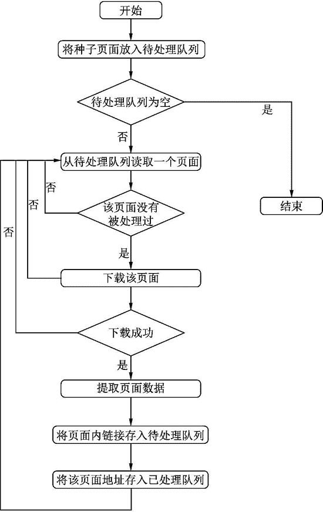

# 网络爬虫的工作原理

> 原文：[`www.weixueyuan.net/a/729.html`](http://www.weixueyuan.net/a/729.html)

网络爬虫是一种数据收集的方式，广泛用于搜索引擎、市场分析等领域。

爬虫从一个或若干种子页面开始，获得种子页面上的链接，并根据需求来追踪其中的一些链接，达到遍历所有网页的目的。在抓取网页的过程中，一方面提取需要的数据信息，另外一方面从当前页面上抽取新的网页地址放入待处理队列，直到满足系统一定的停止条件。

图 1 爬虫基本工作流程
如图 1 所示，爬虫的基本工作流程如下：

1.  确定一个或者多个种子页面。
2.  将种子页面地址放入待处理队列中。
3.  从待处理队列读取一个地址信息。如果待处理队列为空，结束。
4.  如果该地址没有被处理过，并且是希望处理的页面，继续执行；否则跳到第 3 步。
5.  得到该地址的页面内容。
6.  将该页面中符合期望的数据信息保存到结果。
7.  将该页面中符合要求的链接存入待处理队列。
8.  将该地址从待处理队列挪到已处理队列中。
9.  跳到第 3 步，重复执行。