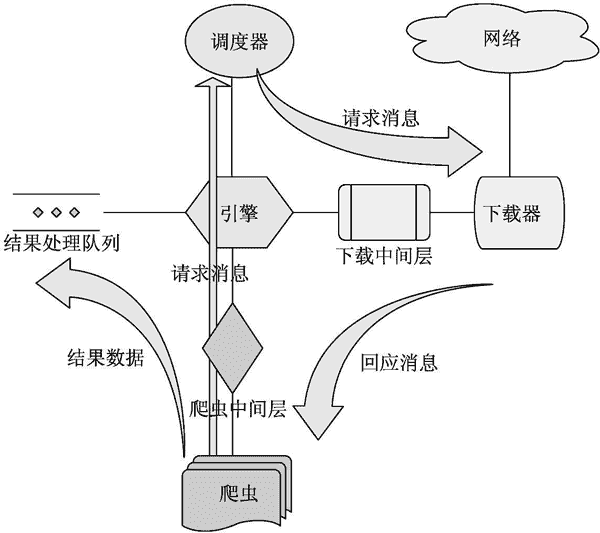

# Scrapy 框架的运行流程

> 原文：[`www.weixueyuan.net/a/733.html`](http://www.weixueyuan.net/a/733.html)

Scrapy 主要包含引擎、下载器、爬虫、调度器和项目管道。

引擎（Scrapy Engine）处于核心位置，主要负责各个组件之间的通信和数据传递。所有的数据交流都是要通过引擎的。

爬虫（Spiders）将要请求的地址信息通过 Scrapy Engine 传给 Scheduler（调度器）。我们的主要任务就是编写自己的 Spider。

调度器（Scheduler）接收了引擎发送来的 Requests（请求），并按顺序排列整理，然后把处理好的 Requests 再次发送给引擎，由引擎通过 Downloader Middlewares（下载中间件）发送给 Downloader（下载器）。

下载器（Downloader）通过下载中间件的设置来下载引擎传过来的 Requests，并且将获取到的 Response（响应数据）又发送给引擎（如果有下载失败的 Requests，那么下载器会在后面接着下载）。

引擎收到 Response 后，再将它发送给 Spiders，Spiders 解析 Response 并提取出需要的数据，如果还有需要继续请求的 URL，会继续执行上面的循环。

Spiders 将这些数据发送给引擎，最后引擎将这些数据发送给 Item Pipeline 进行数据处理和存储。

图 1 描述了主要的组件以及它们之间的数据流程。

图 1 Scrapy 架构图
Scrapy 运行的基本流程如下：

*   确定爬虫名称和要抓取的初始网站。
*   向网站发起请求 Requests 获得响应数据 Responses。
*   解析 Responses 提取数据，如果有需要跟进的地址则继续循环执行第二步。
*   将需要的数据通过管道 Pipeline 的处理。
*   处理完的数据传给 Item 保存。