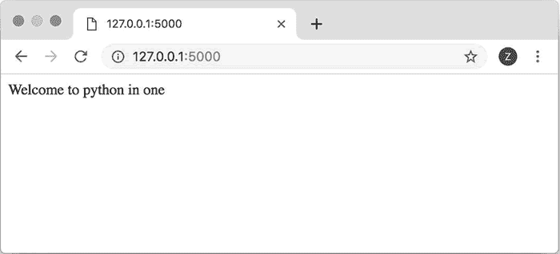

# Flask 框架的安装（Windows 平台）

> 原文：[`www.weixueyuan.net/a/747.html`](http://www.weixueyuan.net/a/747.html)

Flask 是一个用 Python 实现的 Web 应用框架。

使用 Flask 开发 Web 应用程序是很简单的，只需要提供某 URL 的对应操作的处理函数即可，至于 HTTP 请求是如何触发该处理函数的、该处理函数的返回值是如何被返回给浏览器的等问题，都不需要开发者操心，Flask 会完成这一切。

Flask 的安装比较简单，推荐使用 PIP 来完成。对于 Windows 系统，可以使用下面的命令：

pip install flask

在安装 Flask 的过程中，其所依赖的包 Werkzeug 也被自动安装，Werkzeug 会完成底层的网络连接功能。

下面的代码演示了如何使用 Werkzeug 来实现最简单的 Web 服务功能：

```

from werkzeug.wrappers import Request, Response
@Request.application                            # 定义一个处理函数
def demo1(request):
    return Response('Welcome to python in one')    # 返回 html 文档的内容
if __name__ == '__main__':                        #
    from werkzeug.serving import run_simple
    run_simple('localhost', 8086, demo1)        # 运行在 8086 端口上
```

使用以下命令运行该程序以启动 Web 服务。

$ python flaskDemo1.py
* Running on http://localhost:8086/ (Press CTRL+C to quit)

在浏览器中输入地址 http://localhost:8086/ 即可看到在 demo1() 中的输出。

## 最简单的 Flask 应用

安装完成后，接下来创建一个 Python 文件，在该文件中启动 Flask 应用程序。

通过不到 10 行的代码就可以得到一个 Flask 应用程序，下面是这个迷你版的应用的代码：

```

from flask import Flask
# 创建一个应用对象，名字为 first_flask_demo
app1 = Flask('first_flask_demo')
@app1.route('/')                # 给 app1 添加处理函数，其对于 URL 是/
def demo1():
    return 'Welcome to python in one'
if __name__ == '__main__':
    app1.run()                    # 启动应用程序
```

下面来运行该程序：

$ python flaskDemo2.py
* Serving Flask app "first_flask_demo" (lazy loading)
* Environment: production
   WARNING: Do not use the development server in a production environment.
   Use a production WSGI server instead.
* Debug mode: off
* Running on http://127.0.0.1:5000/ (Press CTRL+C to quit)

可以发现其运行在 127.0.0.1:5000 上。现在在浏览器中输入地址 http://localhost:5000/ 即可看到我们代码输出的内容了。

图 1 所示是浏览器中显示的内容。


图 1 最简单的 Flask 应用程序的效果