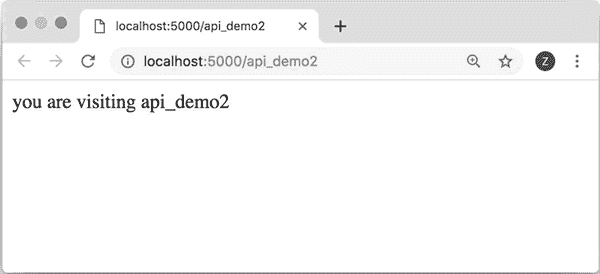
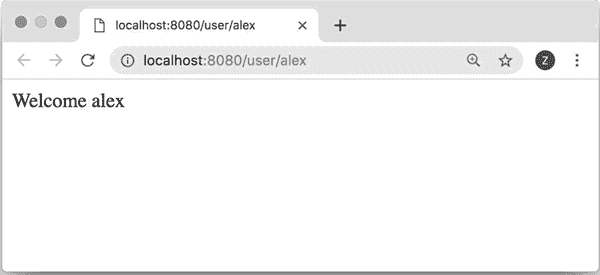
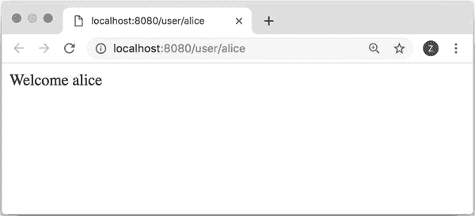
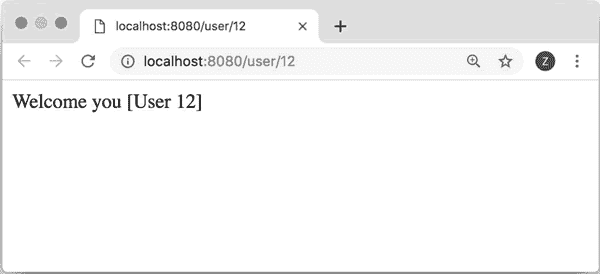
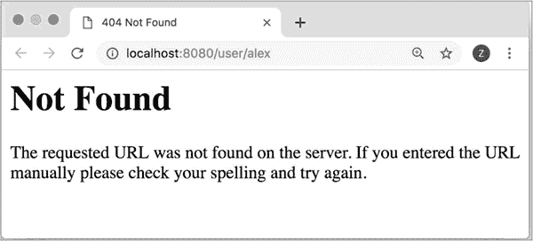
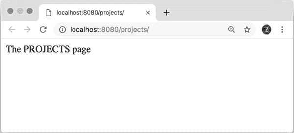
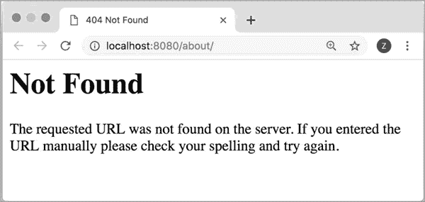

# Flask route 路由详解

> 原文：[`www.weixueyuan.net/a/749.html`](http://www.weixueyuan.net/a/749.html)

在《Flask 框架的安装》一节的例子中，我们定义了一个路由，即“/”，使用的方法是：

@app1.route('/')

app1 是我们创建的应用对象，/ 就是路由，表示如果用户输入了这个地址，那么 Flask 就会调用对应的 demo1() 函数来进行处理。

我们可以给应用定义多个路由，这样不同的 URL 就会有不同的处理函数：

```

from flask import Flask
app1 = Flask('first_flask_demo')
@app1.route('/')
def demo1():
    return 'Welcome to python in one'
@app1.route('/api_demo2')        # 定义另外一个路由
def api_demo2():
    return 'you are visiting api_demo2'
if __name__ == '__main__':
    app1.run()
```

运行后在浏览器中即可输入地址 http://localhost:5000/api_demo2 来查看这个新的地址。图 1 所示为在浏览器查看的效果。


图 1 新定义的路由

## 动态路由

前面介绍的是静态路由，但有些 URL 的格式是 /user/alex，其中 alex 表示用户名，不同的用户会有不同的名字。例如用户名是 bob，那么其对应的 URL 就是 /user/bob。这种情况下可以使用变量来代替名字部分，方法如下：

app.route('/user/<username>')

在处理函数内部可以使用变量 username 来获得输入参数的实际值。下面是一个简单的例子：

```

from flask import Flask
app1 = Flask('first_flask_demo')
@app1.route('/user/<username>')        # 指定了格式
def demo1(username):                    # username 是用户从地址上的输入
    return 'Welcome %s' % username
if __name__ == '__main__':
    app1.run(debug=True, host='0.0.0.0', port=8080)
```

运行后在浏览器中输入地址 http://localhost:8080/user/alex，可以看到输出为 Welcome alex，如图 2 所示：


图 2 欢迎 alex 的页面
如果在浏览器中输入地址 http://localhost:8080/user/alice，则可以看到输出为 Welcome alice，如图 3 所示。


图 3 欢迎 alice 的页面

## 限定类型

如果希望限定输入的动态字段的类型，可以使用 <类型：变量名> 来实现，例如如果希望某个字段只能是整数，那么可以写为 /user/<int:user_id>。

下面是一个简单的例子：

```

from flask import Flask                    # 引入 Flask
app1 = Flask('first_flask_demo')        # 创建应用程序
@app1.route('/user/<int:userid>')        # 限定参数 userid 只能是整数
def demo1(userid):
    return 'Welcome you [User %d]' % userid
if __name__ == '__main__':
    app1.run(debug=True, host='0.0.0.0', port=8080)
```

运行后在浏览器中输入地址 http://localhost:8080/user/12，可以看到 Welcome you[User12] 这样的输出，如图 4 所示。


图 4 正确的用户参数
如果输入的不是整数，例如，输入的地址是 http://localhost:8080/user/alex，则可看到 404 错误，如图 5 所示：


图 5 错误的参数类型
目前 Flask 支持的类型如表 6 所示。

表 6 Flask 支持的数据类型含义

| 类 型 | 含 义 |
| string | 接受任何不包含斜杠的文本，这是默认值 |
| int | 接受正整数 |
| float | 接受正浮点数 |
| path | 类似 string，但可以包含斜杠 |
| uuid | 接受 UUID 字符串 |

## 地址尾部的“/”

如果路由的尾部带有“/”，那么在浏览器的地址栏中输入“/”和不输入“/”的效果是一样的。如果路由的尾部没有“/”，那么在浏览器的地址栏中是不能输入“/”的，否则会出错。

例如下面的代码：

```

from flask import Flask                # 引入 flask 模块
app1 = Flask('first_flask_demo')    # 应用程序
@app1.route('/projects/')            # 注意：尾部带有“/”
def projects():
    return 'The PROJECTS page'
@app1.route('/about')                # 注意：尾部没有“/”
def about():
    return 'The ABOUT page'
if __name__ == '__main__':            # 如果是运行该脚本
    app1.run(debug=True, host='0.0.0.0', port=8080)
```

在输入 http://localhost:8080/projects/ 地址时，一切正常。浏览器显示如图 7 所示：


图 7 /projects/的页面
如果在浏览器的地址栏中输入 http://localhost:8080/projects，则会自动重定向到 http://localhost:8080/projects/，也没有问题。

如果输入 http://localhost:8080/about，一切正常。

如果输入 http://localhost:8080/about/，则会得到 404 错误，如图 8 所示。


图 8 /about/的页面