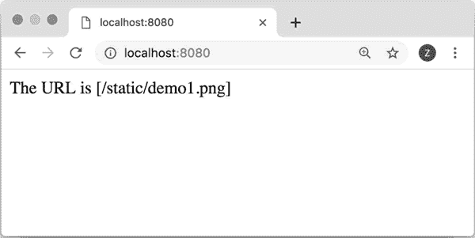
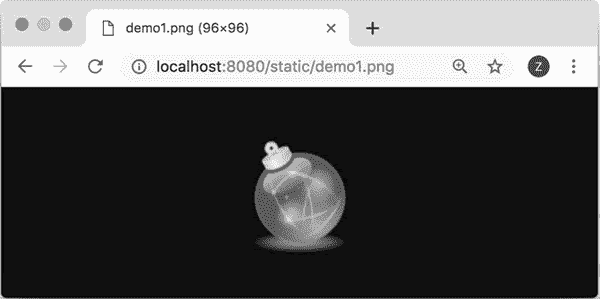

# Flask 静态文件的使用

> 原文：[`www.weixueyuan.net/a/756.html`](http://www.weixueyuan.net/a/756.html)

对于网页来说，静态文件是不可避免的。即使简洁如 Google，其主页也包含有图片。静态文件通常是 css 文件、js 文件以及图片、视频、音频文件等。

假定在 static 目录下有一个文件 demo1.png，那么我们可以通过地址 http://localhost:8080/static/demo1.png 来访问该文件。

```

from flask import Flask, url_for
app1 = Flask('first_flask_demo')
@app1.route('/')
def index():
    png_url = url_for('static', filename='demo1.png')
    return 'The URL is [%s]' % png_url
if __name__ == '__main__':
    app1.run(debug=True, host='0.0.0.0', port=8080)
```

在浏览器中输入地址 http://localhost:8080/，可以看到输出为 The URL is [/static/demo1.png]，如图 1 所示。


图 1 静态文件的地址

如果在浏览器输入图 1 中的地址信息，可以看到如图 2 所示的图片。


图 2 显示静态图片文件