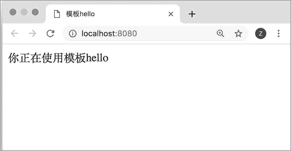
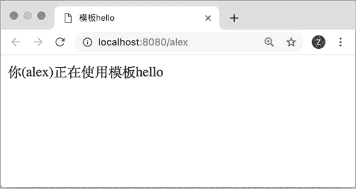
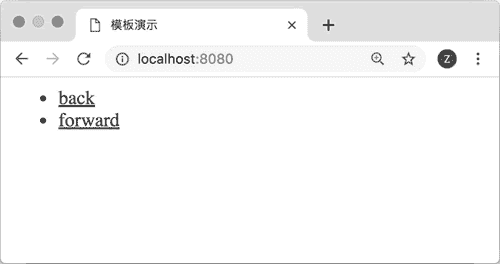
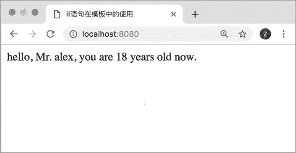
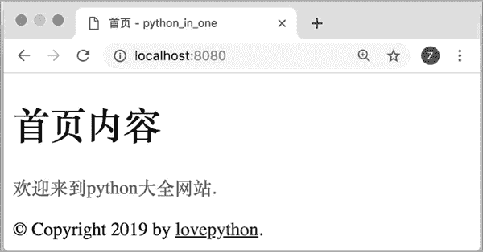

# Flask 模板详解

> 原文：[`www.weixueyuan.net/a/757.html`](http://www.weixueyuan.net/a/757.html)

我们在前面都是通过返回一个字符串的方式来处理浏览器的请求，该字符串就是 html 页面的内容。该方法比较笨拙，我们可以直接让其返回一个文件的内容。如果在 templates 目录下创建了一个文件 hello.html，那么我们就可以直接将该文件返回给浏览器让其显示。

下面是该模板文件的内容：

<html>
    <head>
        <title>模板 hello</title>
    </head>
    <body>   
        你正在使用模板 hello<BR>
    </body>
</html>

下面是在代码中使用该模板的方法：

```

from flask import Flask, url_for, render_template
app1 = Flask('first_flask_demo')
@app1.route('/')
def index():
    return render_template('hello.html')
if __name__ == '__main__':
    app1.run(debug=True, host='0.0.0.0', port=8080)
```

在浏览器中输入 http://localhost:8080/，便可以看到模板文件的内容了，如图 1 所示。


图 1 模板的效果
这种使用模板的方法是比较简单的，只是将要输出的 html 放到单独的文件中去了。但是默认动态功能，比如说不同人看见的内容是不同。Flask 使用的是 jinja 模板，它是支持这种动态的。

模板一般包含两个动态元素，一个是变量，一个是表达式。

## 变量

如果需要在页面中显示欢迎人的名字，可以使用 {{变量名}} 来表示。例如，可以将前面的模板文件修改为：

<html>
    <head>
        <title>模板 hello</title>
    </head>
    <body>
         你({{username}})正在使用模板 hello<BR>
    </body>
</html>

然后将代码修改为：

```

from flask import Flask, url_for, render_template
app1 = Flask('first_flask_demo')
@app1.route('/<user_name>')
def index(user_name):
    return render_template('hello2.html', username=user_name)
if __name__ == '__main__':
    app1.run(debug=True, host='0.0.0.0', port=8080)
```

运行该代码后，在浏览器中输入 http://localhost:8080/alex，就可以看到“你(alex)正在使用模板 hello”这样的输出，如图 2 所示。


图 2 模板变量使用效果

## 表达式

表达式需要放在  之间。我们可在这里放任意的 Python 语句。

#### 1) for 表达式

模板内容如下：

<html>
  <head>
      <title>模板演示</title>
  </head>
  <body>
      <ul id="navigation">
         
         <li><a href="{{ item.href }}">{{ item.caption }}</a></li>
         
       </ul>
  </body>
</html>

代码内容如下：

```

from flask import Flask, url_for, render_template
app1 = Flask('first_flask_demo')
@app1.route('/')
def index():
    data = [
        {"href":"back.html", "caption":"back"},
        {"href":"forward.html", "caption":"forward"},
    ]
    return render_template('hello3.html', href_list=data)
if __name__ == '__main__':
    app1.run(debug=True, host='0.0.0.0', port=8080)
```

在浏览器中输入地址 http://localhost:8080/，可以看到如图 3 所示的内容。


图 3 带有 for 语句的模板

#### 2) if 表达式

需要将 if 表达式放到  之间，还可以放入 else、endif、elif 等语句，endif 表示表达式结束。

下面是一个模板的例子，代码如下：

<!doctype html>
<html>
  <head>
    <title>if 语句在模板中的使用</title>
  </head>
  <body>
    hello,
                # if
        Mr.
                            # else
        Ms.
                            # endif
    {{ name }},
    you are {{ age }} years old now.
  </body>
</html>

使用该模板的代码如下：

```

from flask import Flask, url_for, render_template
app1 = Flask('first_flask_demo')
@app1.route('/')
    def index():
    args = {                            # 给模板的参数
        'name': "alex",
        'gender': "male",
        'age': 18
    }
    return render_template('ifdemo1.html', **args)        # 使用模板
if __name__ == '__main__':
    app1.run(debug=True, host='0.0.0.0', port=8080)
```

现在在浏览器中输入地址 http://localhost:8080/，便可以看到如图 4 所示的内容。


图 4 if 语句在模板中的使用

## 子模板

有一个基础模板叫作 layout.html，其内容如下：

<!doctype html>
<html>
  <head>
    
    <link rel="stylesheet" href="{{ url_for('static', filename=
         'style.css') }}">
    <title> - python_in_one</title>
    
  </head>
  <body>
    <div id="content"></div>
    <div id="footer">
      
      &copy; Copyright 2019 by <a href="http://lovepython.cn/">
           lovepython</a>.
      
    </div>
  </body>
</html>

下面定义一个派生的模板，命名为 subtemplate1.html，其内容如下：


首页

  {{ super() }}
  <style type="text/css">
    .important { color: #336699; }
  </style>


  <h1>首页内容</h1>
  <p class="important">
    欢迎来到 Python 大全网站.


定义代码来使用该模板，代码如下：

```

from flask import Flask, url_for, render_template
app1 = Flask('first_flask_demo')
@app1.route('/')
def index():
    return render_template('subtemplate1.html')
    if __name__ == '__main__':
    app1.run(debug=True, host='0.0.0.0', port=8080)
```

运行该代码后，打开页面 http://localhost:8080/，可以看到如图 5 所示的内容。


图 5 子模板的使用