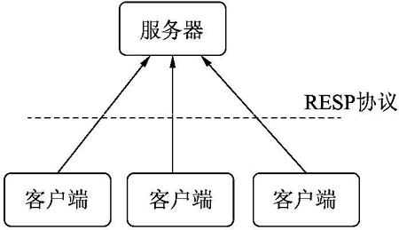
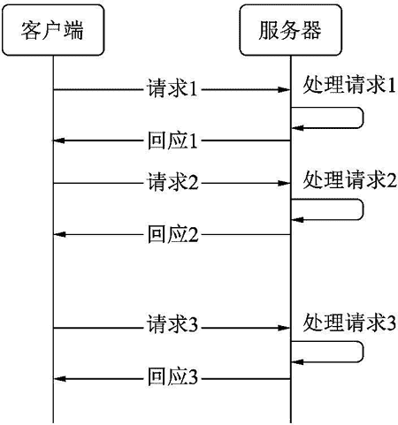
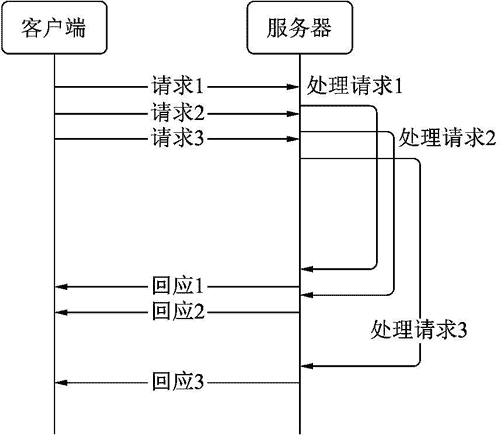
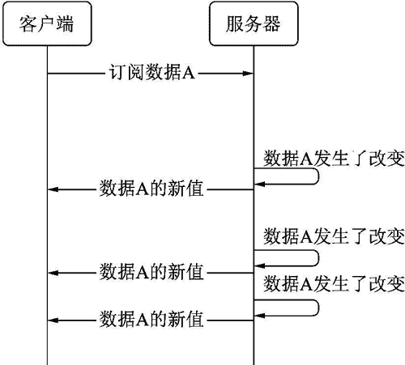

# Redis 是什么

> 原文：[`www.weixueyuan.net/a/758.html`](http://www.weixueyuan.net/a/758.html)

Redis 是一种开源的键值数据库，其相较于传统的关系数据库要简单很多。由于其结构简单，其速度也能快很多。

为了进一步提升性能，键值数据库一般使用内存保存数据，还使用 C 语言来进行开发。根据官方数据，其可以达到 100000 次/秒的读操作，81000 次/秒千次的写操作。传统的关系数据库 MySQL 只能达到 5000 次/秒的读操作，写操作只能达到 3000 次/秒。

和 MySQL 类似，Redis 系统地包括服务器端和客户端两个角色。客户端和服务器通过 RESP 协议通信，如图 1 所示。

图 1 Redis 架构图
Redis 服务器通常使用 TCP 端口 6379。其常用的工作模式是客户端发送一个请求，服务器处理该请求，然后将结果返回给客户端，如图 2 所示。

图 2 普通工作模式
另外一种工作模式是管道（pipelining）模式，其不等待前面的回应消息就发送下一条请求以提升吞吐量，如图 3 所示。

图 3 pipeline 工作模式
第三种工作模式是订阅模式，就是客户端先告诉服务器其关心哪些数据，然后在这些数据发生改变时服务器主动发送消息通知客户端。在该模式中，客户端不是主动去请求某个数据，而是服务器主动通知客户端某个数据的最新值，如图 4 所示。

图 4 订阅模式