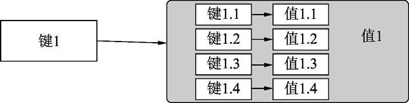

# Python redis 模块哈希操作

> 原文：[`www.weixueyuan.net/a/771.html`](http://www.weixueyuan.net/a/771.html)

在 Redis 中，哈希就是键值对组成的集合。相较于字符串，值为集合，而且集合的每个元素包含两个部分，第一部分为键，第二部分为值。

或者说，该类型的值就是一个小的 Redis 集合，可以用图 1 来表示这种关系。


图 1 哈希数据类型
下面介绍常用的哈希数据的操作。

1) hset（键，子键，值）：该函数用于添加或修改指定子键的值。如果指定的键不存在，就创建该键；如果指定的子键不存在，就创建该子键。否则修改该键下面的子键的值。如果是添加操作，那么返回 1，否则返回 0。

```

>>> r.exists("key1")
0
>>> r.hset("key1", "key1.1", "val1.1")
1
>>> r.exists("key1")
1
>>> r.type("key1")
b'hash'
>>> r.hset("key1", "key1.2", "val1.2")
1
>>> r.hset("key1", "key1.3", "val1.3")
1
>>> r.hset("key1", "key1.4", "val1.4")
1
```

2) hget（键，子键）：该函数用于得到指定键下某个子键的值如果该键或者子键不存在，那么返回 None。

```

>>> r.hget('key1', 'key1.1')            # 指定了键和子键
b'val1.1'
>>> x = r.hget('key1', 'key1.100')        # 子键不存在
>>> x is None                            # 返回值为 None
True
>>> x = r.hget('key100', 'key1.1')        # 键不存在
>>> x is None                        # 返回值为 None
True
```

3) hkeys（键）：该函数用于得到指定键下所有的子键。

```

>>> r.hkeys("key1")
[b'key1.1', b'key1.2', b'key1.3', b'key1.4']
```

4) hlen（键）：该函数用于统计指定键下所有的子键个数。

```

>>> r.hlen("key1")
4
```

hexists（键，子键）：该函数用于判断是否存在某个子键。返回值是一个布尔型的，True 表示在指定键下有该子键；False 表示没有该键或者该键下面没有该子键。

```

>>> r.hexists("key1", "key1.2")    # 是否在键 key1 下存在子键 key1.2
True                                # 存在
>>> r.hexists("key100", "key1.10")    # 指定的键不存在，返回 False
False
>>> r.hexists("key1", "key1.10")    # 指定的键存在，但是该键下没有指定的子键
False
```

5) hmget（键，多个子键）：该函数用于返回一个或多个指定键的值。多个子键可以用列表来表示，或者用多个参数来表示，也可以混着使用。返回值是一个列表，该列表的顺序和子键的顺序一致。

```

>>> r.hmget("key1", 'key1.1', 'key1.2')        # 用多个参数表示
[b'val1.1', b'val1.2']
>>> r.hmget("key1", ['key1.1', 'key1.2'])        # 用列表表示多个子键
[b'val1.1', b'val1.2']
>>> r.hmget("key1", ['key1.1', 'key1.2'], 'key1.3')    # 混合表示
[b'val1.1', b'val1.2', b'val1.3']
```

6) hmset（键，子键值字典）：该函数用于批量设置指定键下面的子键和值。需要将子键和值放到字典中。

```

>>> hval = {"key1.10": "val1.10", "key1.11": "val1.11"}   # 子键值字典
>>> r.hmset('key1', hval)                        # 批量设置
True
>>> r.hget('key1', 'key1.10')                    # 查看是否设置成功
b'val1.10'
>>> r.hget('key1', 'key1.11')
b'val1.11'
```

7) hvals（键）：该函数返回指定键下面的所有值。返回值是一个列表。

```

>>> r.hvals("key1")
[b'val1.1', b'val1.2', b'val1.3', b'val1.4']
```

8) hkeys（键）：该函数返回指定键下面的所有子键。返回值是一个列表。

```

>>> r.hkeys("key1")
[b'key1.1', b'key1.2', b'key1.3', b'key1.4']
```

9)hgetall（键）：该函数返回指定键下面所有的子键和值。返回值是一个字典，里面的键就是哈希的子键，值就是哈希的值。

```

>>> r.hgetall("key1")
{b'key1.1': b'val1.1', b'key1.2': b'val1.2', b'key1.3': b'val1.3',
     b'key1.4': b'val1.4'}
```

如果该键不存在，返回一个空的字典。

```

>>> r.exists("key2")
0
>>> r.hgetall("key2")
{}
```