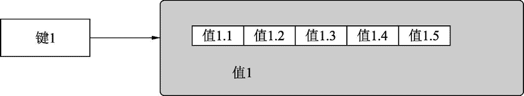

# Python redis list 列表操作

> 原文：[`www.weixueyuan.net/a/774.html`](http://www.weixueyuan.net/a/774.html)

本节主要介绍对列表数据类型的操作，包括在左右两边添加元素、在指定位置添加元素、删除指定位置的元素等。

列表数据类型的结构如图 1 所示。

图 1 列表类型
1) lindex（键，位置）：该函数用于得到指定键下某个位置的值。位置是整数，0 表示第一个位置的元素的值。

```

>>> r.exists('list_obj2')            # 是否存在 list_obj2 这个键
1                                    # 存在
>>> r.llen('list_obj2')                # 该键包含多少个元素
3                                    # 3 个元素
>>> r.lindex('list_obj2', 0)        # 0 表示第一个位置的元素
b'3'
>>> r.lindex('list_obj2', 1)        # 1 表示第二个位置的元素
b'2'
>>> r.lindex('list_obj2', 2)        # 2 表示第三个位置的元素
b'1'
```

2) lrange（键，开始位置，结束位置）：该函数返回指定键下指定区间内元素的值，当然也可以得到所有元素的值。返回值是一个列表。

```

>>> r.exists('list_obj2')            # 是否存在 list_obj2 这个键
1                                    # 存在
>>> r.llen('list_obj2')                # 该键包含多少个元素
3                                    # 3 个元素
>>> r.lrange('list_obj2', 0, 3)    # 返回所有元素的值
[b'3', b'2', b'1']
```

3) lpush（键，值）：该函数用于在列表的左边插入元素。返回值是修改后列表中元素的个数。

```

>>> r.lpush('list1', 12)
1                                        # 现在只有元素
>>> r.type('list1')                        # 查看类型
b'list'
>>> r.lindex('list1', 0)                # 查看第一个元素的值
b'12'
>>> r.lpush('list1', 18)                # 在左边插入一个元素 18
2                                        # 现在有两个元素了
>>> r.lindex('list1', 0)                # 读取第一个元素的值
b'18'
>>> r.lindex('list1', 1)                # 读取第二个元素的值
b'12'
>>> r.lindex('list1', -1)                # 允许使用-1 表示最后一个元素的值
b'12'
```

允许一次插入多个元素，方法是传入多个参数。最后一个参数是最后被插入的，所以其也是在列表的最左边，也就是 index=0 的位置。

```

>>> r.lpush('list1', 1, 2, 3)            # 一次在左边插入 1、2 和 3
7                                        # 现在有 7 个元素
>>> r.lindex('list1', 0)                # 最左边的元素应该是 3
b'3'
>>> r.lindex('list1', 1)                # 左边第二个元素应该是 2
b'2'
>>> r.lindex('list1', 2)                # 左边第三个元素应该是 1
b'1'
```

4) rpush（键，值）：该函数用于在列表的右边插入元素。返回值是插入后列表的元素个数。

```

>>> r.rpush('list1', 180)                # 在右边插入一个元素 180
3                                        # 现在包含 3 个元素
>>> r.lindex('list1', -1)                # 查看最右边的元素的值
b'180'                                    # 就是刚才插入的值
>>> r.rpush('list1', 190)                # 再在右边插入一个新的值 190
4
>>> r.lindex('list1', -1)                # 查看最右边的元素的值
b'190'
```

和 lpush() 一样，也可以一次插入多个元素：

```

>>> r.rpush('list1', 199, 299, 399)    # 插入 3 个元素
10
>>> r.lindex('list1', -1)                # 最右边的元素是 399
b'399'
>>> r.lindex('list1', -2)                # 右边第二个元素是 299
b'299'
>>> r.lindex('list1', -3)                # 右边第三个元素是 199
b'199'
```

可以发现 rpush(list,val1,val2,val3) 等效于下面的代码段：

rpush(list, val1)
rpush(list, val2)
rpush(list, val3)

5) llen（键）：该函数用于返回指定键下元素的个数，其仅对列表对象有效。

```

>>> r.exists('list_obj2')            # 是否存在键 list_obj2
0                                    # 不存在
>>> r.lpush('list_obj2', 1, 2, 3)    # 依次在左边插入 1、2、3 三个元素
3                                    # 现在列表中有 3 个元素了
>>> r.exists('list_obj2')            # 是否存在键 list_obj2'
1                                    # 存在
>>> r.type('list_obj2')                # 该键对象的值的类型
b'list'                                # 列表
>>> r.llen('list_obj2')                # 得到对应键的列表元素个数
3                                    # 元素个数为 3
```

6) lpop()：该函数用于删除最左边的元素。返回值是原来最左边元素的值。

```

>>> r.lindex('list1', 0)            # 原来第一个元素的值为 3
b'3'
>>> r.lindex('list1', 1)            # 原来第二个元素的值为 2
b'2'
>>> r.lpop('list1')                    # 删除第一个元素
b'3'                                # 删除的元素的值
>>> r.lindex('list1', 0)            # 现在第一个元素就是原来的第二个元素了
b'2'
```

7) rpop（键）：该函数用于删除最右边的元素。返回值是原来最右边元素的值。

```

>>> r.lindex('list1', -1)            # 最右边元素的值
b'399'
>>> r.lindex('list1', -2)            # 倒数第二个元素的值
b'299'
>>> r.rpop('list1')                    # 弹出最右边的，也就是倒数第一个元素
b'399'                                # 弹出元素的值
>>> r.lindex('list1', -1)    # 现在的最后一个元素，就是原来的倒数第二个元素
b'299'
```