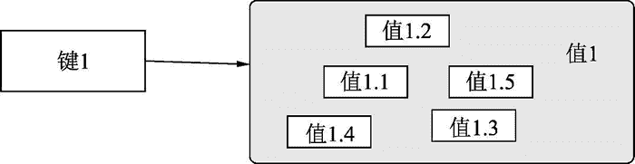
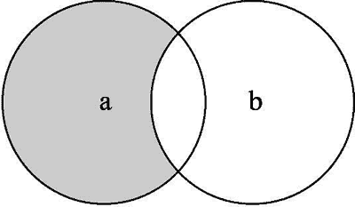
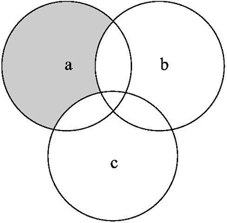
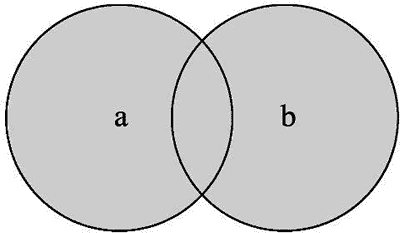

# Python redis set 集合操作

> 原文：[`www.weixueyuan.net/a/776.html`](http://www.weixueyuan.net/a/776.html)

本章主要介绍对集合数据的操作，集合数据类型的结构如图 1 所示。


图 1 集合类型
1) sadd()：该函数用于向集合中添加单个或多个元素，返回新添加的元素个数。如果某个值以前就存在了，就不会添加了，所以实际添加的元素个数可能比请求添加的个数少。

```

>>> r.sadd('set1', 1)            # 添加一个元素 1
1                                # 成功添加了一个元素
>>> r.type('set1')                # 类型是 set
b'set'
>>> r.sadd('set1', 2, 3, 4)        # 添加多个元素   
3                                # 成功添加 3 个元素
>>> r.sadd('set1', 2, 3, 100)    # 再次添加多个元素
1                                # 仅新添加了一个元素
```

2) scard()：该函数返回集合中元素的个数。

```

>>> r.sadd('set1', 1)            # 添加一个元素
1
>>> r.type('set1')
b'set'
>>> r.sadd('set1', 100)            # 再次添加一个元素
1
>>> r.sadd('set1', "name")
1
>>> r.scard('set1')                # 得到现在集合中元素的个数
3                                # 现在有三个元素了
```

3) smembers（键）：该函数得到集合内所有的元素，返回一个普通的集合。

```

>>> r.smembers('set1')
{b'name', b'100', b'1'}            # 返回一个集合
>>> type(x)                        # 得到返回值的类型
<class 'set'>
```

4) sdiff（键 a，键 b）：该函数用于求两个集合的差集，并返回一个集合，该集合包含属于集合 a 且不属于集合 b 的元素，如图 2 所示。


图 2 差集

```

>>> r.sadd("set1", 1, 2, 3)
3
>>> r.sadd("set2", 2, 3, 100)
3
>>> r.sdiff("set1", "set2")
{b'1'}
```

其实参数还可以有集合 c，表示从集合 a 中去掉所有属于集合 b 或者集合 c 内的元素后剩余的部分，如图 3 所示。


图 3 多个集合的差集
例如可以有三个集合 set1、set2 和 set3，现在要求 set1-set2-set3 的值。

```

>>> r.sadd("set1", 1, 2, 3)                # 定义集合 set1
3
>>> r.sadd("set2", 2, 3, 100)            # 定义集合 set2
3
>>> r.sdiff("set1", "set2")                # set1-set2
{b'1'}
>>> r.sadd("set3", 1, 3, 200)            # 定义集合 set3
3
>>> r.sdiff("set1", "set2", "set3")    # 求 set1-set2-set3
set()          
```

5) sunion（键 1，键 2）：该函数用于求两个集合的合集。合集就表示这样的集合，其元素要么来自输入集合 a，要么来自输入集合 b，如图 4 所示。


图 4 合集