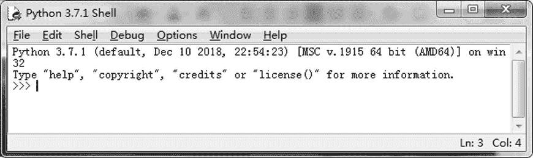
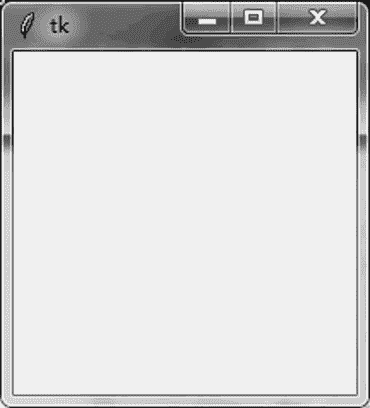
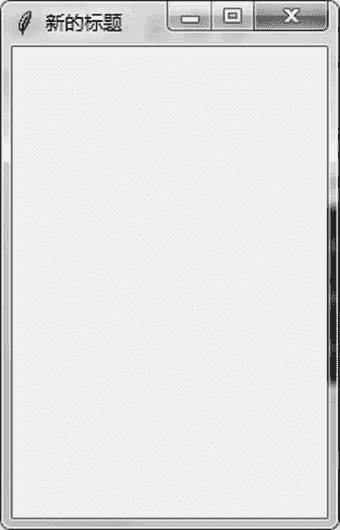

# Tkinter 库的基本用法

> 原文：[`www.weixueyuan.net/a/784.html`](http://www.weixueyuan.net/a/784.html)

Tk 最初是 TCL 语言的一个图形界面的包。TCL 语言是在 1988 年发布的一种脚本语言，因此 Tk 包可以被看作其他图形界面包的祖先，后来出现的各种图形界面包都或多或少地借鉴了其设计思想。

Tk 也被移植到了很多脚本语言中，例如 Perl 语言中的 Perl/Tk 模块、PHP 语言中的 phptk 模块、Ruby 语言中的 Ruby/Tk 模块。当然 Python 也集成了这个模块，而且是一个 Python 自带的模块，称为 Tkinter。

我们在前面介绍的解释器 IDLE 也是用 Tk 这个模块编写的。图 1 所示为 IDLE 的界面，包括菜单栏、输入框、状态栏等。


图 1 IDLE 应用程序
Tkinter 模块在 Python 2 和 Python 3 中的名称有所不同，在 Python 2 中是 Tkinter，所以引入该模块需要使用下面的代码：

import Tkinter

在 Python 3 中，这个模块的名字是 tkinter，所以引入该模块需要使用下面的代码：

import tkinter

为了保持代码的一致性，这里使用下面的引入包的方法：

```

import sys                                # 引入 sys 包
if sys.version_info.major == 3:        # 如果是 Python 3
    import tkinter as tk
elif sys.version_info.major == 2:        # 如果是 Python 2
    import Tkinter as tk
```

## 基本程序结构

最简单的 Tk 程序只需要包含两行代码，一行代码用于创建窗口，一行代码用于启动该窗口并处理相关操作。

下面是我们的第一个 Tk 程序：

```

import sys
if sys.version_info.major == 3:
    import tkinter as tk
elif sys.version_info.major == 2:
    import Tkinter as tk
main_win = tk.Tk()                        # 创建窗口
main_win.mainloop()                        # 启动窗口并进行相关消息处理
```

运行该程序，可以看到如图 2 所示的窗口。


图 2 最简单的 Tkinter 程序
这就是一个普通的窗口，可以进行移动、关闭、最小化和最大化等操作。我们还可以做更多的事情，如给其加上标题、设定窗口的大小等。

```

import sys
if sys.version_info.major == 3:
    import tkinter as tk
elif sys.version_info.major == 2:
    import Tkinter as tk
main_win = tk.Tk()                # 创建一个窗口
main_win.title(u"新的标题")        # 修改窗口的标题
    # 修改窗口的尺寸，200 为宽，300 为高，单位是像素
main_win.geometry("200x300")
main_win.mainloop()                # 进入事件处理循环
```

运行后可以看到如图 3 所示的窗口。


图 3 修改标题后的窗口

> Tkinter 库还提供有众多组件，这些组件将在后续章节中继续讲解。