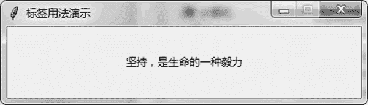
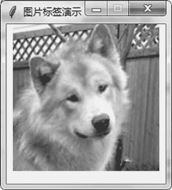

# Tkinter Label 标签的用法

> 原文：[`www.weixueyuan.net/a/788.html`](http://www.weixueyuan.net/a/788.html)

和 Windows 编程类似，在 Tkinter 中最常用的也是一些组件。Tkinter 几乎包含其他图形界面库所包含的全部组件，不同的组件可以完成不同的任务。

标签（Label）用来显示静态的文本信息。创建一个标签最简单，只需要一个参数，即父窗口。

label_obj = tk.Label(main_win)

当然还可以设置其他的属性，如背景颜色、对齐方式等。

下面实现一个有意思的标签，用鼠标单击该标签时，标签的内容会发生改变。这些显示在标签中的内容来自一些心灵鸡汤。

```

import sys
if sys.version_info.major == 3:
    import tkinter as tk
elif sys.version_info.major == 2:
    import Tkinter as tk
import random                                    # 引入 random 库
# 显示的内容，每次随机从这里挑选一条出来显示
idiom = [
    u"""世上任何生命都不是尽善尽美的""",
    u"""让我们怀着善良的心去做成人之美之事""",
    u"""心存大爱，则无可阻之道""",
    u"""心存美好，则无可恼之事""",
    u"""做人无德不足以立身""",
    u"""微笑可以减轻紧张的情绪和压力""",
    u"""退一步，海阔天空""",
    u"""心存善良，则无可恨之人""",
    u"""人生的最佳状态是淡定从容""",
    u"""以责人之心责己，以恕己之心恕人""",
    u"""一个人的涵养，来自一颗包容的心""",
    u"""善良是心湖绽放柔媚的花朵""",
    u"""努力是一种生活态度，与年龄无关""",
    u"""不为困苦所屈服""",
    u"""人生因有梦想而充满动力""",
    u"""坚持，是生命的一种毅力""",
    u"""努力是一种生活态度，与年龄无关"""
]
# 标签被单击的处理函数，当用鼠标左键单击标签时这个函数被调用
def label_click_handler(events):
    selected = random.randint(0, len(idiom)-1)
    label_obj1['text'] = idiom[selected]        # 修改标签的内容
root = tk.Tk()                                     # 初始化 Tk()
root.title(u"标签用法演示")                        # 设置窗口标题
root.geometry("400x80")                            # 宽 x 高
# 不可以调整窗口大小
root.resizable(width=False, height=False)
selected = random.randint(0, len(idiom)-1)
label_obj1 = tk.Label(root, text=idiom[selected], width=380, height=60)
# 鼠标左键单击了标签，处理函数是 label_click_handler()
label_obj1.bind("<Button-1>",label_click_handler)
label_obj1.pack(side=tk.LEFT)
root.mainloop()                                 # 进入消息循环
```

运行后可以看到如图 1 所示的窗口。


图 1 静态标签
标签除了显示文本外，也可以显示图片。下面的例子通过属性 image 来设置标签上的图片：

```

import sys
if sys.version_info.major == 3:
    import tkinter as tk
elif sys.version_info.major == 2:
    import Tkinter as tk
root = tk.Tk()                             # 初始化 Tk()
root.title(u"图片标签演示")               # 设置窗口标题
root.geometry("200x200")                 # 宽 x 高
# 不可以调整窗口大小
root.resizable(width=False, height=False)
# 打开文件 dog.png
pic1 = tk.PhotoImage(file="dog.png")
# 通过参数 image 来设定图片
label_obj1 = tk.Label(root, image=pic1, width=180, height=180)
label_obj1.pack(side=tk.TOP)
root.mainloop()                         # 进入消息循环
```

运行后可以看到图 2 所示的窗口。


图 2 显示图片的静态标签