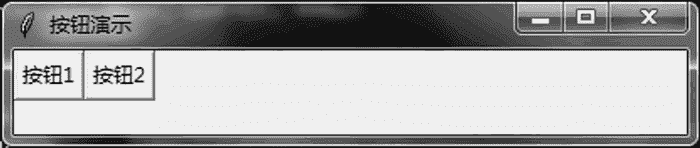
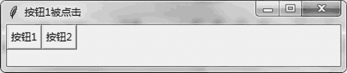
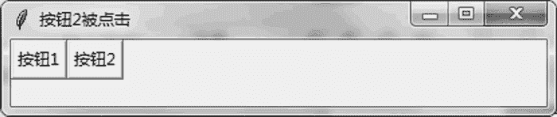

# Tkinter Buttion 按钮的用法

> 原文：[`www.weixueyuan.net/a/789.html`](http://www.weixueyuan.net/a/789.html)

和 Windows 编程类似，在 Tkinter 中最常用的也是一些组件。Tkinter 几乎包含其他图形界面库所包含的全部组件，不同的组件可以完成不同的任务，本节介绍的 Button 按钮就属于其中的一个。

按钮（Button）有两个比较常用的属性，一个是 text，表示按钮上的文字；另外一个是 command，表示该按钮被鼠标单击时需要调用的函数。

下面的代码演示了创建按钮和处理按钮事件。在按钮被单击时修改窗口的标题信息，第一个按钮被单击时显示“按钮 1 被单击”，第二个按钮被单击时显示“按钮 2 被单击”。这里我们借用标题栏来作为调试输出。

```

import sys
if sys.version_info.major == 3:
    import tkinter as tk
elif sys.version_info.major == 2:
    import Tkinter as tk
def button1_click_handler():            # 第一个按钮被单击的处理函数
    root.title(u"按钮 1 被单击")
def button2_click_handler():            # 第二个按钮被单击的处理函数
    root.title(u"按钮 2 被单击")
root = tk.Tk()                            # 主窗口
root.title(u"按钮演示")                    # 窗口标题
root.geometry("400x50")
button1 = tk.Button(root, text=u"按钮 1", command=button1_click_
     handler)
button1.grid(row=0, column=0)
button2 = tk.Button(root, text=u"按钮 2", command=button2_click_
     handler)
button2.grid(row=0, column=1)
root.mainloop()
```

运行后出现如图 1 所示的窗口。


图 1 普通按钮
单击“按钮 1”后窗口如图 2 所示。


图 2 单击按钮后修改标题
单击“按钮 2”后窗口如图 3 所示。


图 3 再次单击按钮后修改标题