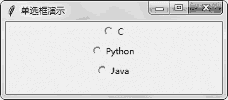
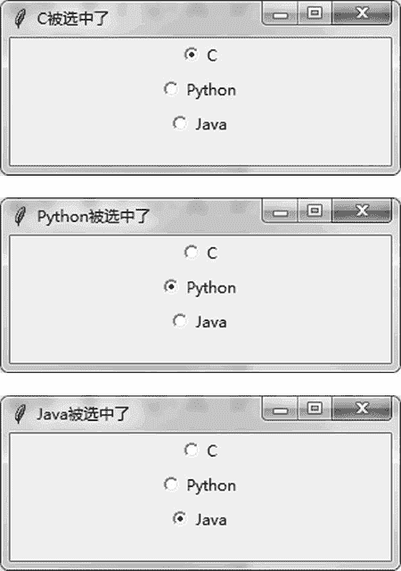

# Tkinter Radiobutton 单选框的用法

> 原文：[`www.weixueyuan.net/a/791.html`](http://www.weixueyuan.net/a/791.html)

单选框（Radiobutton）表示该组元素仅可以选中其中一个元素。

创建单选框时，多个同组的元素的 variable 属性要相同，这样才表示它们是属于一个组的。另外，同一个组内的元素 value 属性应该不同，这样当某个元素被选中时，variable 指定的值就等于该元素对应的 value 属性的值。

```

import sys                                # 引入 sys 模块
if sys.version_info.major == 3:        # 如果是 Python 3
    import tkinter as tk
elif sys.version_info.major == 2:        # 如果是 Python 2
    import Tkinter as tk
import random
class DemoApplication(tk.Frame):
    def on_radiobox_changed(self):
        if self.check_box_var1.get()==1:
            main_win.title(u"C 被选中了")
        elif self.check_box_var1.get()==2:
            main_win.title(u"Python 被选中了")
        elif self.check_box_var1.get()==3:
            main_win.title(u"Java 被选中了")
        else:
            main_win.title(u"单选框演示")
    def createWidgets(self):
        self.check_box_var1 = tk.IntVar()
        # 创建单选框 1
        self.check_box1 = tk.Radiobutton(main_win,
                                         text=u'C',
                                         variable = self.check_box_var1,
                                         value = 1,
                                         command=self.on_radiobox_changed)      
        self.check_box1.pack()
        # 创建单选框 2
        self.check_box2 = tk.Radiobutton(main_win,
                                         text=u'Python',
                                         variable = self.check_box_var1,
                                         value = 2,
                                         command=self.on_radiobox_changed)      
        self.check_box2.pack()
        # 创建一个单选框
        self.check_box3 = tk.Radiobutton(main_win,
                                      text=u'Java',
                                      variable = self.check_box_var1,
                                           value = 3,
                                           command=self.on_radiobox_changed)
        self.check_box3.pack()
    def __init__(self, master=None):
        tk.Frame.__init__(self, master)
        self.createWidgets()
main_win = tk.Tk()                        # 创建主窗口
main_win.title(u"单选框演示")            # 设置主窗口的标题
main_win.geometry("300x100")            # 设置主窗口的大小
app = DemoApplication(master=main_win)
app.mainloop()                            # 启动消息循环
```

运行该程序，可以看到如图 1 所示的窗口。


图 1 单选框初始状态
不同单选框被选中后的状态如图 2 所示。


图 2 不同单选框被选中后的状态