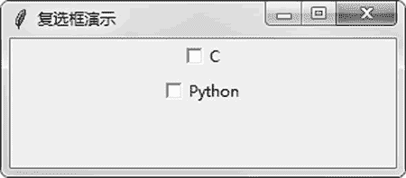
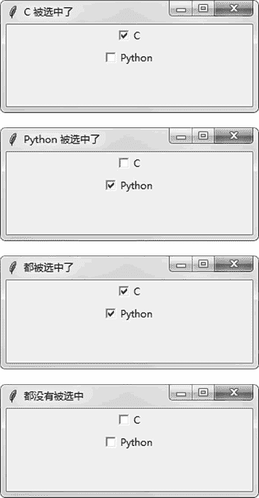

# Tkinter Checkbutton 复选框的用法

> 原文：[`www.weixueyuan.net/a/792.html`](http://www.weixueyuan.net/a/792.html)

和 Windows 编程类似，在 Tkinter 中最常用的也是一些组件。Tkinter 几乎包含其他图形界面库所包含的全部组件，不同的组件可以完成不同的任务，本节介绍的 Checkbutton 就属于其中的一个。

复选框（Checkbutton）表示可以选中多个该组元素。下面是一个创建复选框的例子。

```

import sys
if sys.version_info.major == 3:
    import tkinter as tk
elif sys.version_info.major == 2:
    import Tkinter as tk
import random
class DemoApplication(tk.Frame):
    def on_checkbox_changed(self):
        if self.check_box_var1.get()==1 and self.check_box_var2.get()==1:
            main_win.title(u"都被选中了")
        elif self.check_box_var1.get():
            main_win.title(u"C 被选中了")
        elif self.check_box_var2.get():
            main_win.title(u"Python 被选中了")
        else:
            main_win.title(u"都没有被选中")
    def createWidgets(self):
        self.check_box_var1 = tk.IntVar()
        self.check_box_var2 = tk.IntVar()
        # 创建一个多选框
        self.check_box1 = tk.Checkbutton(main_win,
                                       text=u'C',
                                       variable = self.check_box_var1,
                                       onvalue = 1,
                                       offvalue = 0,
                                       command=self.on_checkbox_changed)
        self.check_box1.pack()
        # 创建一个多选框
        self.check_box2 = tk.Checkbutton(main_win,
                                       text=u'Python',
                                       variable = self.check_box_var2,
                                       onvalue = 1,
                                       offvalue = 0,
                                       command=self.on_checkbox_changed)
        self.check_box2.pack()
    def __init__(self, master=None):
        tk.Frame.__init__(self, master)
        self.createWidgets()
main_win = tk.Tk()
main_win.title(u"多选框演示")
main_win.geometry("300x100")
app = DemoApplication(master=main_win)
app.mainloop()
```

运行后显示图 1  所示的窗口。


图 1 多选框的初始状态
选中某个复选框后的显示如图 2 所示，注意窗口的标题发生了改变。


图 2 鼠标操作多选框后的状态