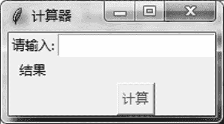
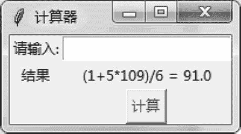

# Tkinter Entry 文本框的用法

> 原文：[`www.weixueyuan.net/a/795.html`](http://www.weixueyuan.net/a/795.html)

和 Windows 编程类似，在 Tkinter 中最常用的也是一些组件。Tkinter 几乎包含其他图形界面库所包含的全部组件，不同的组件可以完成不同的任务，本节介绍的 Entry 就属于其中的一个。

Entry 组件是一个单行的文本输入框。下面是一个简易的文本计算器的例子：

```

import sys
if sys.version_info.major == 3:
    import tkinter as tk
elif sys.version_info.major == 2:
    import Tkinter as tk
class Calculator(tk.Frame):                    # 定义一个窗口
    def calc(self):                            # 对文本输入框的内容进行计算
        input_str = self.entry_obj.get()
        result = eval(input_str)
        result_str = str(result)
        out_str = input_str + " = " + result_str
        self.result['text'] = out_str        # 将计算结果输出到静态标签中
        self.entry_obj.delete(0, tk.END)        # 清空文本输入框的内容
    def createWidgets(self):
        self.input_label = tk.Label(self, text=u"请输入:")
        self.input_label.grid(row=0)
        self.entry_obj = tk.Entry(self)
        self.entry_obj.grid(row=0, column=1)
        self.result_label = tk.Label(self, text=u"结果")
        self.result_label.grid(row=2, column=0)
        self.result = tk.Label(self, text=u"")
        self.result.grid(row=2, column=1)
        self.calc_button = tk.Button(self)
        self.calc_button.grid(row=3, column=1)
        self.calc_button["text"] = u"计算"
        self.calc_button["fg"]   = "red"
        self.calc_button["command"] =  self.calc
    def __init__(self, master=None):
        tk.Frame.__init__(self, master)
        self.createWidgets()
        self.pack()
root = tk.Tk()
root.title(u"计算器")
app = Calculator(master=root)
app.mainloop()
```

运行后的结果如图 1 所示。


图 1 文本计算器
输入计算的公式后，单击“计算”按钮就可以看到结果了，如图 2 所示。


图 2 文本计算器的使用