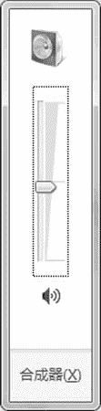
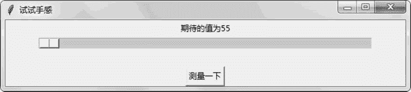
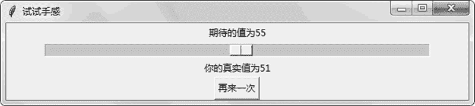

# Tkinter Scale 滑块组件的用法

> 原文：[`www.weixueyuan.net/a/796.html`](http://www.weixueyuan.net/a/796.html)

Tkinter 库中，支持通过滑动滑块（Scale）来设置属性值，最常见的就是设定音量，如图 1 所示便是 MAC 上的音量调节滑块：


图 1 MAC 上的音量控制器
图 2 所示便是 Windows 上的音量调节滑块：


图 2 Windows 上的音量控制器
创建滑块的方法是：

scale_obj = tk.Scale(父亲组件)

常用的滑块属性包括：

*   取值范围，默认是 0 到 100，也可以用 from 和 to 来表示范围；
*   方向属性 orient，其初始是竖向的，如果希望是横向的，需要设置为 tk.HORIZONTAL；
*   组件的长度 length，单位是像素，如果该值比较大，就表示滑块的尺寸比较大；
*   分辨率 resolution，表示可以增加或减少的最小值；
*   回调函数 command()，就是在拖动滑块时调用该函数来通知滑块的运动事件。

下面编写一个游戏程序，在游戏开始时，程序输出一个 1 到 100 之间的整数值，现在需要拖动滑块到该值对应的位置，然后单击“测量一下”按钮来查看当前滑块对应的真实值，看看自己对位置估计的能力。如果不太满意，可以单击“再来一次”按钮来进行下一次测试。

下面是完整的代码：

```

import sys        # 引入 sys 模块，用来判断当前的解释器是 Python 2 还是 Python 3
if sys.version_info.major == 3:            # 如果是 Python 3
    import tkinter as tk
elif sys.version_info.major == 2:            # 如果是 Python 2
    import Tkinter as tk
import random                                # 引入 random 模块，出题用的
class DemoApplication(tk.Frame):            # 定义一个窗口类
    def measure(self):
        # 还没有测量
        if self.button_operation.state == 0:
            real_val = self.scale_bar.get()    # 得到真实值
            self.real_label['text'] = u"你的真实值为%d" % real_val
            self.button_operation["text"] = u"再来一次"    # 修改按钮文字
            self.button_operation.state = 1    # 修改状态
        else:                                   # 已经测量过了
            self.expected_val = random.randint(0, 100)
            expected_label_txt = u"期待的值为%d" % self.expected_val
            self.expected_label['text'] = expected_label_txt
            self.real_label['text'] = ""
            self.button_operation.state = 0
            self.button_operation["text"] = u"测量一下"
    def createWidgets(self):
        self.expected_val = random.randint(0, 101)
        expected_label_txt = u"期待的值为%d" % self.expected_val
        self.expected_label = tk.Label(main_win, text=expected_label_
             txt)
        self.expected_label.pack()
        self.scale_bar = tk.Scale(main_win, orient=tk.HORIZONTAL, showvalue=0)
        self.scale_bar['length'] = 500
        self.scale_bar.pack()
        self.real_label = tk.Label(main_win, text="")
        self.real_label.pack()
        self.button_operation = tk.Button(main_win)
        self.button_operation.state = 0
        self.button_operation["text"] = u"测量一下"
        self.button_operation["command"] = self.measure
        self.button_operation.pack()
    def __init__(self, master=None):
        tk.Frame.__init__(self, master)
        self.pack()
        self.createWidgets()
main_win = tk.Tk()
main_win.title(u"试试手感")
main_win.geometry("600x100")
app = DemoApplication(master=main_win)
app.mainloop()
```

运行后的效果如图 3 所示。


图 3 估算位置初始画面
拖动滑块到估计的位置，然后单击“测量一下”按钮会显示测试结果，如图 4 所示。


图 4 查看实际值