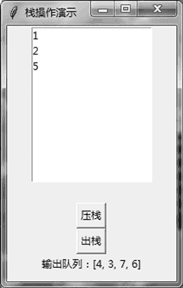

# Tkinter Listbox 列表框的用法

> 原文：[`www.weixueyuan.net/a/798.html`](http://www.weixueyuan.net/a/798.html)

列表框（Listbox）组件用来存放一个列表数据，可以对其数据进行添加和删除操作。

下面使用该组件实现一个栈，在头部进行压栈和出栈操作。为了让例子更加有趣，规定压栈的数据只能从“1，2，3，…，10”这个队列的头部取，也就是第一次压栈的数据是 1，第二次压栈的数据是 2，以此类推。问仅通过压栈和出栈操作能否得到指定的输出序列，如“10，9，8，7，6，5，4，3，2，1”，也就是说第一次出栈的是 10，第二次出栈的是 9，以此类推。

```

import sys
if sys.version_info.major == 3:            # Python 3
    import tkinter as tk
elif sys.version_info.major == 2:            # Python 2
    import Tkinter as tk
import random
class DemoApplication(tk.Frame):
    def pop(self):
        element_num = self.list_box1.size()
        if element_num == 0:
            print("Error: No Element")
        else:
            # 栈中有元素
            # 得到最后一个元素的值，该类型是字符串类型的
            las_val = self.list_box1.get(tk.END)
            las_val = int(las_val)                       # 转换成整数类型
            # 将最后一个元素放入输出队列的尾部
            self.output_list.append(las_val)
            # 删除最后一个元素
            self.list_box1.delete(tk.END)
            msg = u"输出队列：%s" % self.output_list
            self.expected_label['text'] = msg
            if element_num == 1:
                self.button_pop.config(state=tk.DISABLED)
    def push(self):
        if self.next_push > 10:
            self.button_push.config(state=tk.DISABLED)
        else:
            # 在尾部添加
            self.list_box1.insert(tk.END,str(self.next_push))
            self.next_push = self.next_push + 1
            if self.next_push > 10:
                # 不让入栈了
                self.button_push.config(state=tk.DISABLED)
            # 如果刚才不让执行出栈操作，那么现在可以进行出栈操作了
            print("self.button_pop['state'] = %s" % self.button_pop
                 ['state'])
            if self.button_pop['state'] == tk.DISABLED:
                self.button_pop.config(state=tk.NORMAL)
    def createWidgets(self):
        self.expected_val = random.randint(0, 101)
        self.list_box1 = tk.Listbox(main_win)         # 创建一个列表框
        self.list_box1.pack()
        self.next_push = 1
        self.real_label = tk.Label(main_win, text="")
        self.real_label.pack()
        self.button_push = tk.Button(main_win)
        self.button_push.state = 0
        self.button_push["text"] = u"压栈"
        self.button_push["command"] = self.push
        self.button_push.pack()
        self.button_pop = tk.Button(main_win)
        self.button_pop.state = 0
        self.button_pop["text"] = u"出栈"
        self.button_pop["command"] = self.pop
        # 最开始，栈中没有元素，所以不可以出栈
        self.button_pop.config(state=tk.DISABLED)
        self.button_pop.pack()
        self.expected_label = tk.Label(main_win, text="输出队列：")
        self.expected_label.pack()
    def __init__(self, master=None):
        tk.Frame.__init__(self, master)
        self.output_list = []
        self.pack()
        self.createWidgets()
main_win = tk.Tk()                            # 创建主窗口
main_win.title(u"栈操作演示")                # 设置窗口标题
main_win.geometry("200x300")                # 设置窗口大小
app = DemoApplication(master=main_win)        # 创建应用程序
app.mainloop()                                # 进入消息循环
```

运行后结果如 1 所示。


图 1 压栈出栈操作
当全部压栈完成，并且所有元素都出栈时，显示如图 2 所示的界面。


图 2 全部出栈完成
列表框默认只能选中一个元素，但是可以通过设置参数 selectmode 的值为 MULTIPLE 来允许选中多个元素。为了演示这个属性，下面来玩一个游戏，就是在给定的数中挑出一些数，要求这些数的和要尽量接近指定的值 t。

这里用 Listbox 来存放数组 l，用户可以从中任意挑选元素。在挑选的过程中，显示目前挑选数的和。在用户完成挑选后单击“查看答案”按钮可以查看是否得到了正确的结果。

下面是完整的代码：

```

import sys
if sys.version_info.major == 3:
    import tkinter as tk
elif sys.version_info.major == 2:
    import Tkinter as tk
import random
class DemoApplication(tk.Frame):
    # 背包问题的求解方法
    def resolve_bag(self, bag_volume, goods_list):
        biggest_valid_vol = 0
        biggest_valid_selection = []
        goods_num = len(goods_list)
        candidate_num = 1 << goods_num
        for candidate in range(candidate_num):
            selection_decision = []
            for x in range(goods_num):
                if (candidate & 1) == 1:
                    selection_decision.append(True)
                else:
                    selection_decision.append(False)
                candidate = candidate >> 1
            current_vol = 0
            for x in range(goods_num):
                if selection_decision[x] == True:
                    current_vol = current_vol + goods_list[x]
            if current_vol <= bag_volume and current_vol > biggest_valid_
                 vol:
                biggest_valid_vol = current_vol
                biggest_valid_selection = selection_decision
            result = [goods_list[x] for x in range(goods_num) \
                   if biggest_valid_selection[x] == True]
            return result
    def show_answer(self):                    # 显示标准答案
        answer_list = self.resolve_bag(self.target, self.data)
        standard_answer_sum = sum(answer_list)
        if abs(self.current_sum-self.target) <= \
                 abs(standard_answer_sum-self.target):
            # 用户的也是标准答案
            user_answer_list = [self.data[x] for x in self.list_box1.
                 curselection()]
            answer_label_text = u"标准答案是: %s" % user_answer_list
        else:
            answer_label_text = u"标准答案是: %s" % answer_list
        self.answer_label['text'] = answer_label_text
    def selection_evt_handler(self, evt):    # 选中某个元素的处理函数
        seleted_index_list = self.list_box1.curselection()
        sum = 0
        for x in seleted_index_list:
            sum = sum + self.data[x]
        self.current_sum = sum
        actual_sum_label_text = u"当前的和为%d" % self.current_sum
        self.actual_label['text'] = actual_sum_label_text
    def reset(self):                            # 重新开始
        self.generate_data()
        expect_label_txt = u"期望的和为%d" % self.target
        self.expected_label['text'] = expect_label_txt
        self.answer_label['text'] = ""
    def generate_data(self):                # 产生输入数据
        # 一共是 8 个元素，从 0 到 7，全部删除
        self.list_box1.delete(0, 7)
        self.data = []
        for x in range(8):
            v = random.randint(1, 20)
            self.data.append(v)
        self.target = random.randint(20, 60)
        for x in self.data:
            self.list_box1.insert(tk.END,str(x))
    def createWidgets(self):            # 画出初始界面
        self.expected_val = random.randint(0, 101)
        self.list_box1 = tk.Listbox(main_win)
        # 允许选中多个元素
        self.list_box1["selectmode"] = tk.MULTIPLE
        self.list_box1.pack()
        self.list_box1.bind("<<ListboxSelect>>", self.selection_evt_
             handler)
        self.generate_data()
        self.next_push = 1
        self.real_label = tk.Label(main_win, text="")
        self.real_label.pack()
        expect_label_txt = u"期望的和为%d" % self.target
        self.expected_label = tk.Label(main_win, text=expect_label_txt)
        self.expected_label.pack()
        self.current_sum = 0
        actual_label_txt = u"当前的和为%d" % self.current_sum
        self.actual_label = tk.Label(main_win, text=actual_label_txt)
        self.actual_label.pack()
        self.answer_label = tk.Label(main_win, text="")
        self.answer_label.pack()
        self.button_reset = tk.Button(main_win)
        self.button_reset.state = 0
        self.button_reset["text"] = u"重新开始"
        self.button_reset["command"] = self.reset
        self.button_reset.pack()
        self.button_end = tk.Button(main_win)
        self.button_end.state = 0
        self.button_end["text"] = u"查看答案"
        self.button_end["command"] = self.show_answer
        self.button_end.pack()
    def __init__(self, master=None):        # 初始化函数
        tk.Frame.__init__(self, master)
        self.output_list = []
        self.pack()
        self.createWidgets()
    main_win = tk.Tk()
    main_win.title(u"选中最接近目标的元素组合")
    main_win.geometry("250x350")
    app = DemoApplication(master=main_win)
    app.mainloop()
```

开始运行时的显示如图 3 所示。


图 3 初始界面
在查看答案时得到如图 4 所示的窗口。


图 4 完成后查看答案