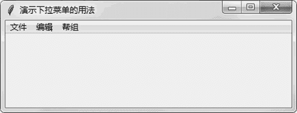

# Tkinter Menu 菜单组件的用法

> 原文：[`www.weixueyuan.net/a/800.html`](http://www.weixueyuan.net/a/800.html)

菜单是常见的 UI 元素。下面创建一个特别简单的菜单，仅包含两个菜单项。代码如下：

```

import sys
if sys.version_info.major == 3:
    import tkinter as tk
elif sys.version_info.major == 2:
    import Tkinter as tk
def hello_handler():
    pass
root = tk.Tk()
root.title(u"演示菜单的用法")
# 创建一个菜单
menubar = tk.Menu(root)
menubar.add_command(label=u"单击我试试!", command=hello_handler)
menubar.add_command(label=u"退出", command=root.quit)
# 将菜单添加到主窗口中
root.config(menu=menubar)
root.mainloop()
```

运行后菜单的显示如图 1 所示。


图 1 带有菜单的窗口
当然也可以创建下拉菜单，下面演示了创建的方法。

```

import sys
if sys.version_info.major == 3:
    import tkinter as tk
elif sys.version_info.major == 2:
    import Tkinter as tk
def hello_handler():
    pass
root = tk.Tk()
root.title(u"演示下拉菜单的用法")
# 创建一个菜单
main_menu_bar = tk.Menu(root)
# 创建一个子菜单
filemenu = tk.Menu(main_menu_bar, tearoff=0)
filemenu.add_command(label=u"打开", command=hello_handler)
filemenu.add_command(label=u"保存", command=hello_handler)
filemenu.add_separator()
filemenu.add_command(label=u"退出", command=root.quit)
# 将子菜单加入到菜单条中
main_menu_bar.add_cascade(label=u"文件", menu=filemenu)
# 创建一个子菜单
editmenu = tk.Menu(main_menu_bar, tearoff=0)
editmenu.add_command(label=u"剪切", command=hello_handler)
editmenu.add_command(label=u"复制", command=hello_handler)
editmenu.add_command(label=u"粘贴", command=hello_handler)
# 将子菜单加入到菜单条中
main_menu_bar.add_cascade(label=u"编辑", menu=editmenu)
# 创建一个子菜单
helpmenu = tk.Menu(main_menu_bar, tearoff=0)
helpmenu.add_command(label=u"关于", command=hello_handler)
# 将子菜单加入到菜单条中
main_menu_bar.add_cascade(label=u"帮组", menu=helpmenu)
# 将菜单添加到主窗口中
root.config(menu=main_menu_bar)
root.mainloop()
```

运行后出现如图 2 所示的窗口。


图 2 初始化时的窗口
分别打开这三个菜单项，显示如图 3 所示。


图 3 展开的下拉菜单