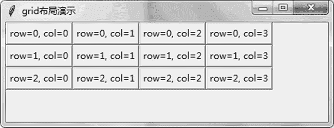

# Tkinter 布局（3 种）

> 原文：[`www.weixueyuan.net/a/802.html`](http://www.weixueyuan.net/a/802.html)

在前面的介绍中，基本没有布局过 UI 元素，所有元素都是从上到下摆成一列，很不美观。

Tkinter 提供了布局功能，主要包含 pack、grid 和 place 三种布局方法。其中 pack 布局方法在前面使用过，这是最简单的布局方式。

```

import sys
if sys.version_info.major == 3:
    import tkinter as tk
elif sys.version_info.major == 2:
    import Tkinter as tk
root = tk.Tk()
root.title(u"pack 布局演示")
tk.Button(root, text="side:top").pack(side='top')
tk.Button(root, text="side:bottom").pack(side='bottom')
tk.Button(root, text="side:left").pack(side='left')
tk.Button(root, text="side:right").pack(side='right')
root.mainloop()
```

启动后窗口显示如图 1 所示。


图 1 pack 布局方式
如果拉伸窗口，显示如图 2 所示。


图 2 拉伸 pack 布局后的效果
grid 布局法就是将屏幕切成表格的样子，通过横向坐标 row 和纵向坐标 column 来指定元素的位置。第一行标记为 0，第一列也标记为 0。

```

import sys
if sys.version_info.major == 3:
    import tkinter as tk
elif sys.version_info.major == 2:
    import Tkinter as tk
root = tk.Tk()
root.title(u"grid 布局演示")
for row in range(3):
    for col in range(4):
        text_ = "row=%d, col=%d" % (row, col)
        tk.Button(root, text=text_).grid(row=row, column=col)
root.mainloop()
```

运行该程序后，显示如图 3 所示的窗口。


图 3 grid 布局
拉伸窗口后，显示如图 4 所示。


图 4 拉伸后的 grid 布局
最后一种布局方法是 place，它直接指定元素在父元素中的坐标值，单位是像素。