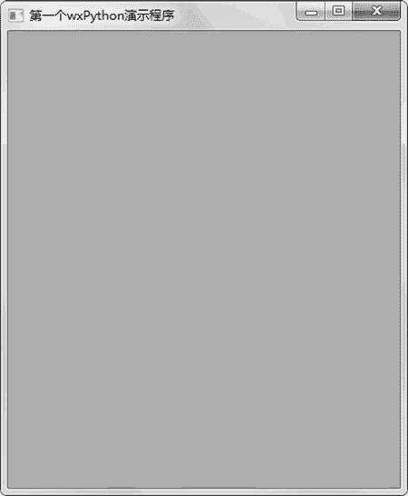

# Python wxPython 库的安装和使用

> 原文：[`www.weixueyuan.net/a/832.html`](http://www.weixueyuan.net/a/832.html)

wxWidgets 是一款优秀的、跨平台的图形界面库，其使用 C++ 语言开发，所以使用 wxWidgets 的最直接的开发语言也是 C/C++。

为了让 Python 用户也能使用该库，Robin Dunn 开发了 wxPython 这个库，该库可以看做是对 wxWidgets 的 Python 封装。有了 wxPython 库，Python 开发人员也可以享受 wxWidgets 带来的强大功能。

在使用 wxPython 之前，首先需要安装 wxPython。安装过程很简单，直接使用 pip 就可以完成，命令如下：

pip install wxpython

> 目前的推荐版本是 wxPython4.0.6。

在完成安装后，需要引入该包，方法如下：

import wx

在 wxPython 中，一个程序一般包括一个窗口 Frame，一个应用程序 app。在窗口 Frame 中包括了各种用户界面的元素，应用程序 app 则负责对用户界面元素产生的消息进行转发处理。

最简单的一个应用程序如下：

```

import wx    # 引入 wxpython 库
# 创建一个应用程序
# 参数 False 表示标准输出和错误输出内容不会被重定向
app = wx.App(False) 
# 创建一个窗口
# 该窗口的父窗口是 None，就是没有父窗口
# wx.ID_ANY 表示随机生成一个 ID 给该窗口
# 第三个参数是窗口的标题
frame = wx.Frame(None, wx.ID_ANY, u"第一个 wxPython 演示程序")
frame.Show(True)                 # 显示该窗口
app.MainLoop()                      # 应用程序消息处理
```

运行后可以看到如图 1 所示的窗口。


图 1 简单的使用 wxPython 创建的窗口
我们可以对该窗口进行关闭、移动、最小化和最大化等操作，这就是一个最简单的也是最常见的应用程序窗口。

这里需要注意的是父窗口的概念，在 wxPython 中，所有的用户界面元素都可以有父元素，如果父元素是 None 表示该元素没有父元素，所以它是应用程序的最顶级用户界面元素。一般这样的元素就是窗口，其他的如按钮等界面元素，它们都有一个，并且是唯一的一个父亲界面元素。这样属于同一个窗口的所有用户界面元素就形成了一个树形结构，树的根就是窗口元素，它是没有父节点的，其他的元素都有自己的父亲节点。

另外需要注意的是，所有的用户界面元素都有一个 ID，在上面的例子中，我们给 ID 赋值为 wx.ID_ANY，这表示该元素的 ID 由系统自动分配，但是在 ID 分配完成后就不会再发生改变了。

和 Tkinter 一样，wxPython 也提供了很多的基础界面元素，如静态文本框、文本框输入、按钮、单选框、多选框等。这些界面元素的用法和 Tkinter 的类似，可能只是属性的名字有所不同，会在后续章节做详细讲解。