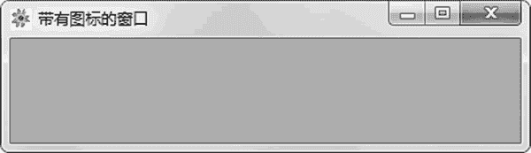

# wxPython Frame 窗体的用法

> 原文：[`www.weixueyuan.net/a/838.html`](http://www.weixueyuan.net/a/838.html)

Frame 就是在桌面上看到的窗口，其包含标题、图标、位置、大小、风格、名字等属性。这些属性可以在创建窗体时设置，也可以在创建后进行设置。

下面是窗体的初始化函数：

```

Frame(parent,
      id=ID_ANY,
      title=EmptyString,
      pos=DefaultPosition,
      size=DefaultSize,
      style=DEFAULT_FRAME_STYLE,
      name=FrameNameStr)
```

窗体比较常用的操作包括显示 show()，隐藏，关闭 close()，移动 move() 等。

下面将前面的代码稍加修改，为其添加一个图标。首先需要装入图标文件，然后使用 SetIcon() 函数来设置图标，完整代码如下：

```

import wx                           # 引入 wxPython 库
app = wx.App(False) 
frame = wx.Frame(None, wx.ID_ANY, u"带有图标的窗口")
# 创建图标
icon_obj = wx.Icon(name="flower.jpg",  type=wx.BITMAP_TYPE_JPEG)
frame.SetIcon(icon_obj)            # 设定图标
frame.Show(True)                 # 显示该窗口
app.MainLoop()                   # 应用程序消息处理
```

运行后显示如图 1 所示的窗口。


图 1 修改窗口图标