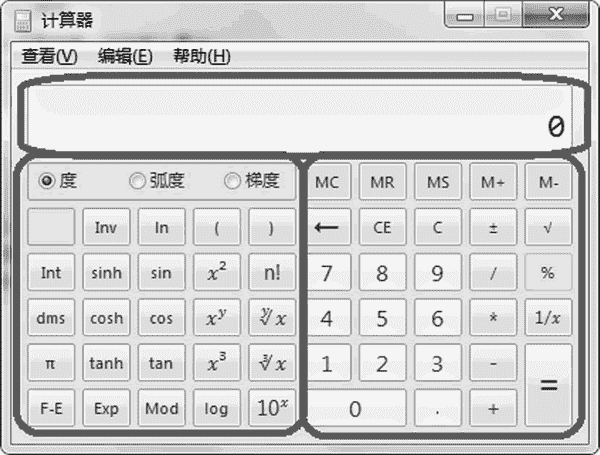
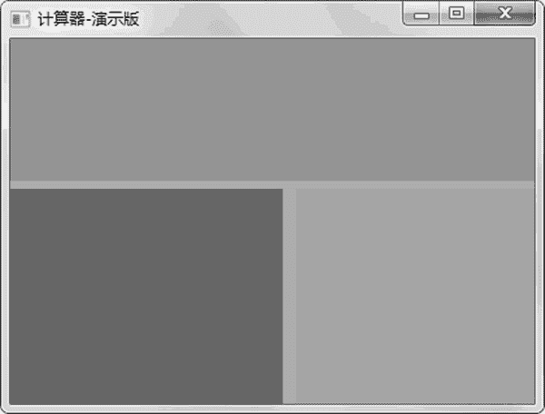

# wxPython Panel 面板的用法

> 原文：[`www.weixueyuan.net/a/839.html`](http://www.weixueyuan.net/a/839.html)

面板是一个容器元素，可以在其上放很多其他的元素，这点类似于 Frame。

我们通常会将窗口上的元素分类，例如图 1 所示的计算器程序，其就可以看做是由三大块组合而成的。


图 1 计算器的结构
可以用使 Panel 来表示这些块。Panel 的初始化函数定义如下：

```

Panel(parent,
      id=ID_ANY,                     # 自己的 ID
      pos=DefaultPosition,             # 自己相对父窗口的位置
      size=DefaultSize,                 # 大小
      style=TAB_TRAVERSAL,             # 风格
      name=PanelNameStr)                # 名字
```

块里面的元素的父元素（parent）就是对应的 Panel，例如现在按钮 1 就不直接隶属于主窗口，而是隶属于右下角的 Panel。

下面就创建这样的窗口，为了显示方便，为三个块设置不同的背景颜色。为了设置 Panel 的背景颜色，使用了其成员函数 SetBackgroundColour()。下面是完整的代码：

```

import wx
# 主窗口类
class MainFrame(wx.Frame):
  def __init__(self, p, t):
    """ p: 父亲窗口
    t:  窗口标题
    """       
    wx.Frame.__init__(self, id=wx.NewId(), parent=p, title=t, size=
         (420, 320))
    # 该 panel 的父亲就是该窗口， id=-1 就表示任意 id
    panel_top = wx.Panel(self, -1, size=(420, 110), pos=(0, 0))
    panel_top.SetBackgroundColour("#DB7093")                # 红色
    panel_left_down = wx.Panel(self, -1, size=(210, 210), pos=(0, 116))
    panel_left_down.SetBackgroundColour("#007FFF")       # 蓝色
    panel_right_down = wx.Panel(self, -1, size=(210, 210), pos=(220, 116))
    panel_right_down.SetBackgroundColour("#00FF7F")     # 绿色
if __name__ == "__main__":                # 如果运行该脚本
    # 创建应用程序
    app = wx.App(False)
    # Frame 就是应用程序的主窗口，不是子窗口
    frame = MainFrame(None, "计算器-演示版")
    frame.Show(True)                     # 显示主窗口
    app.MainLoop()
```

运行后显示如图 2 所示的窗口。


图 2 使用 Panel 来布局计算器