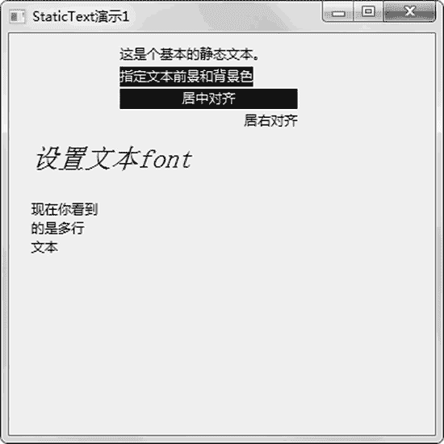

# wxPython StaticText 文本框的用法

> 原文：[`www.weixueyuan.net/a/841.html`](http://www.weixueyuan.net/a/841.html)

StaticText 其对应于 Tkinter 中的 tk.Label。其文本内容用属性 label 来表示，则 label 属性相当于 tk.Label 的 text 属性。其初始化函数定义如下：

```

StaticText(parent,
           id=ID_ANY,
           label=EmptyString,
           pos=DefaultPosition,
           size=DefaultSize,
           style=0,
           name=StaticTextNameStr)
```

对于静态文本框，可以设置字体、对齐方式以及显示多行文本等。下面的例子演示了如何设置这些属性：

```

import wx
class StaticTextDemo1(wx.Frame):            # 定义自己的 Frame 类
    def __init__(self):                        # 初始化函数
        wx.Frame.__init__(self,
                          None,
                          wx.ID_ANY,
                          "StaticText 演示 1",
                          size =(400, 400))
        panel = wx.Panel(self, -1)
        #基本静态的文本
        text1 = wx.StaticText(panel,
                              wx.ID_ANY,
                              "这是个基本的静态文本。",
                              (100, 10))
        #为文本指定前景色和背景色
        text2 = wx.StaticText(panel,
                              wx.ID_ANY,
                              "指定文本前景和背景色",
                              (100, 30))
        text2.SetForegroundColour("White")        # 设定前景色为白色
        text2.SetBackgroundColour("Black")        # 设置背景色为黑色
        #指定居中对齐
        text = wx.StaticText(panel, wx.ID_ANY, "居中对齐", (100,50),
             (160, -1),\
                                wx.ALIGN_CENTER)
        text.SetForegroundColour("White")
        text.SetBackgroundColour("Black")
        #指定右对齐
        text3 =wx.StaticText(panel,
                             wx.ID_ANY,
                             "居右对齐",
                             (100,70),
                             (160, -1),
                             wx.ALIGN_RIGHT)
        #指定字体的静态文本的 font
        text4 = wx.StaticText(panel,
                              wx.ID_ANY,
                              "设置文本 font",
                              (20,100))
       # 设定字体
        font=wx.Font(18, wx.DECORATIVE, wx.ITALIC, wx.NORMAL)
        text4.SetFont(font)
        #设置显示多行文本
        multiStr ="现在你看到\n 的是多行\n 文本"
        text5 = wx.StaticText(panel,
                              wx.ID_ANY,
                              multiStr,
                              (20, 150))
if __name__ == '__main__':
    app = wx.App()
    frame = StaticTextDemo1()
    frame.Show(True)
    app.MainLoop()
```

运行该程序，可以看到图 1 所示的效果。


图 1 静态文本库