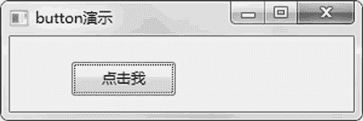
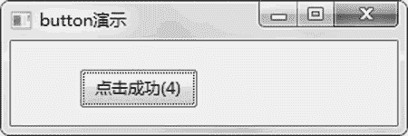

# wxPython Button 按钮的用法

> 原文：[`www.weixueyuan.net/a/842.html`](http://www.weixueyuan.net/a/842.html)

Button 元素的主要属性包括上面的文字 label、单击后的处理函数等。下面是其初始化函数的定义：

```

Button(parent,
       id=ID_ANY,
       label=EmptyString,             # 按钮上显示的内容
       pos=DefaultPosition,
       size=DefaultSize,
       style=0,
       validator=DefaultValidator,
       name=ButtonNameStr)
```

处理函数通过其成员函数 Bind() 来定义，该函数的定义如下：

Bind(self, event, handler, source=None, id=-1, id2=-1)

其中 event 和 handler 是必须定义的，其他的可以不用填写。source 表示事件的发起者，id 表示事件发起者的 ID，id2 用来指定事件发起者的 ID 范围。

下面是一个按钮使用的例子，其窗口有一个按钮，单击该按钮，按钮上的文字发生变化，显示被单击的次数。下面是完整的代码：

```

import wx
# 主窗口类
class MainFrame(wx.Frame):            # 记住一定要从 wx.Frame 派生出主窗口类
  def __init__(self, p, t):
    """ p: 父亲窗口
    t:  窗口标题
    """
    wx.Frame.__init__(self, id=wx.NewId(), parent=p, title=t, size=
           (300, 100))
    # 该 panel 的父亲就是该窗口， id=-1 就表示任意 ID
    panel = wx.Panel(self, -1)
    self.button = wx.Button(panel, -1, u"单击我", pos=(50, 20))
    # 绑定事件，就是指定的 button 被单击后调用 onClick()成员函数
    self.Bind(wx.EVT_BUTTON, self.OnClick, self.button)
    self.button.SetDefault()
    self.clicked_times = 0
  def OnClick(self, event):
    self.clicked_times = self.clicked_times + 1
    # 一旦单击就修改按钮的显示文字
    self.button.SetLabel(u"单击成功(%d)" % self.clicked_times)
if __name__ == "__main__":
    # 创建应用程序
    app = wx.App(False)
    # frame 就是应用程序的主窗口
    frame = MainFrame(None, "button 演示")
    frame.Show(True)                 # 显示该窗口
    app.MainLoop()                    # 进入消息循环
```

运行该程序，显示如图 1 所示的窗口。


图 1 普通按钮
单击窗口上的“单击我”按钮后，显示如图 2 所示。


图 2 单击按钮后的窗口