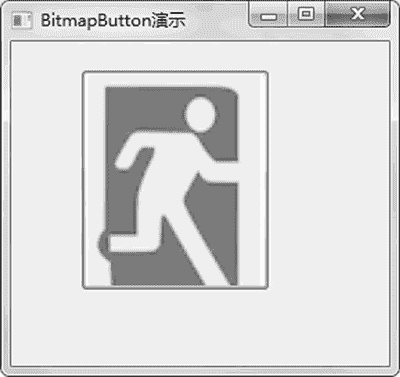

# wxPython BitmapButton 图片按钮的用法

> 原文：[`www.weixueyuan.net/a/844.html`](http://www.weixueyuan.net/a/844.html)

BitmapButton 是一类特殊的按钮，和普通按钮的区别就是该按钮上面不显示文字而是显示图片。

下面是 BitmapButton 元素的初始化函数定义：

```

BitmapButton(parent,
             id=ID_ANY,
             bitmap=NullBitmap,
             pos=DefaultPosition,
             size=DefaultSize,
             style=BU_AUTODRAW,
             validator=DefaultValidator,
             name=ButtonNameStr)
```

下面演示了一个使用该元素的例子，在该例子中，主窗口包含一个图片按钮，如果单击该按钮，应用程序就退出。完整代码如下：

```

import wx                        # 引入 wxPython 包
# 定义主窗口类
class MainFrame(wx.Frame):
  def __init__(self, p, t):        # 初始化函数
    """ p: 父亲窗口                # 第一个参数 p 表示 parent，也就是父元素对象
    t:  窗口标题"""                # 第二个参数 t 表示 title，也就是窗口的标题
    # 基类的初始化函数
    wx.Frame.__init__(self, id=-1, parent=p, title=t, size=(300, 200))
    # 该 panel 的父亲就是该窗口， id=-1 就表示任意 ID
    panel = wx.Panel(self, -1)
    bmp = wx.Image("exit.png", wx.BITMAP_TYPE_PNG).ConvertToBitmap()
    self.button = wx.BitmapButton(panel, -1, bmp, pos=(50, 20))
    # 绑定事件，就是指定的 button 被单击后调用 onClick()成员函数
    self.Bind(wx.EVT_BUTTON, self.OnClick, self.button)
    self.button.SetDefault()
  def OnClick(self, event):
    # 一旦单击就关闭主窗口
    self.Destroy()
if __name__ == "__main__":
    # 创建一个应用程序
    app = wx.App(False)
    # frame 就是应用程序的主窗口
    frame = MainFrame(None, "BitmapButton 演示")
    frame.Show(True)        # 显示主窗口
    app.MainLoop()        # 开始消息循环
```

运行后，显示如图 1 所示的窗口。


图 1 图片按钮