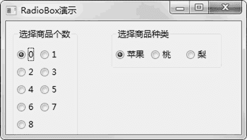
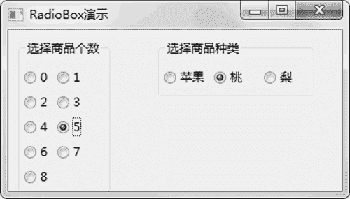

# wxPython RadioBox 单选框的用法

> 原文：[`www.weixueyuan.net/a/845.html`](http://www.weixueyuan.net/a/845.html)

RadioBox 单选框从某一组元素中只能有一个被选中，如果某个元素被单击选中，那么其他元素都会取消选中。

RadioBox 的初始化函数定义如下：

```

RadioBox(parent,
         id=ID_ANY,
         label=EmptyString,             # 关联的文本库
         pos=DefaultPosition,         # 默认值的位置，从 0 开始计数
         size=DefaultSize,
         choices=[],                     # 候选项列表
         majorDimension=0,
         style=RA_SPECIFY_COLS,
         validator=DefaultValidator,
         name=RadioBoxNameStr)
```

该元素包含很多属性，其中最主要的属性有两个，一个是 label，也就是单选框的标题；另外一个是 choices，也就是该组元素的标签列表。另外还有一个接口函数 GetSelection()，用来返回被选中的元素的位置，返回值是一个整数，如果是 0 表示第一个候选项被选中，如果是 1 表示第二个候选项被选中。

下面是选择商品的一个例子，用户可以选择商品个个数和商品种类，并且这两个选项都是单选的。下面是完整的代码：

```

import wx
class RadioButtonFrameDemo1(wx.Frame):
    def __init__(self):
        wx.Frame.__init__(self,
                          None,
                          -1,                # 系统自动生成 ID 值
                          'RadioBox 演示',    # 标题
                          size=(350, 200))
        panel = wx.Panel(self, -1)
        sampleList1 = ['0', '1', '2', '3', '4', '5',
                      '6', '7', '8']
        wx.RadioBox(panel, -1, "选择商品个数", (10, 10), wx.DefaultSize,
                        sampleList1, 2, wx.RA_SPECIFY_COLS)
        sampleList2 = [u'苹果', u'桃', u'梨']
        wx.RadioBox(panel, -1, "选择商品种类", (150, 10), wx.DefaultSize,
                        sampleList2, 3, wx.RA_SPECIFY_COLS | wx.NO_BORDER)
if __name__ == '__main__':
    app = wx.App()
    frame = RadioButtonFrameDemo1()
    frame.Show(True)
    app.MainLoop()
```

运行后可以看到图 1 所示的窗口。


图 1 单选框
可以通过鼠标单击来设定商品种类和个数，操作后窗口如图 2 所示。


图 2 操作单选框后的窗口