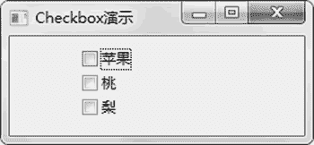
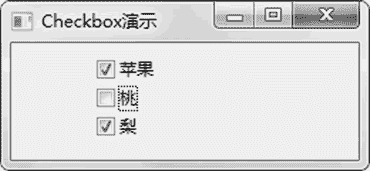

# wxPython CheckBox 复选框的用法

> 原文：[`www.weixueyuan.net/a/850.html`](http://www.weixueyuan.net/a/850.html)

CheckBox 复选框允许选中指定组内的多个元素，或者说每个元素可以独自取选中或者没有选中这两个值，与其他元素无关。

CheckBox 初始化函数定义如下：

```

CheckBox(parent,
         id=ID_ANY,
         label=EmptyString,
         pos=DefaultPosition,
         size=DefaultSize,
         style=0,
         validator=DefaultValidator,
         name=CheckBoxNameStr)
```

在该元素的属性中，最重要的属性就是 label 和 IsChecked，label 属性用来显示这个元素的标签；IsChecked 是一个函数，用来判断该框是否被选中，如果被选中返回 True，否则返回 False。

下面是一个选择水果的例子，用户可以通过复选框同时选中多个水果：

```

import wx
class MainFrame(wx.Frame):
    def __init__(self, p, t):
        wx.Frame.__init__(self,
                          id=-1,            # -1 表示自动生成 id
                          parent=p,
                          size=(260, 120),
                          title=t)
        panel = wx.Panel(self, -1)
        self.checkbox1 = wx.CheckBox(parent=panel,
                                     id=-1,
                                     label=u"苹果",
                                     size=(120, 18),
                                     pos=(60, 10))
        self.checkbox2 = wx.CheckBox(parent=panel,
                                     id=-1,
                                     label=u"桃",
                                     size=(120, 18),
                                     pos=(60, 30))
        self.checkbox3 = wx.CheckBox(parent=panel,
                                     id=-1,
                                     label=u"梨",
                                     size=(120, 18),
                                     pos=(60, 50))
if __name__ == '__main__':
    app = wx.App(False)
    frame = MainFrame(None, "Checkbox 演示")
    frame.Show(True)                     # 显示主窗口
    app.MainLoop()
```

运行该程序，显示图 1 所示的窗口。


图 1 复选框
通过鼠标可以任意选中自己喜欢的水果，操作后的窗口如图 2 所示。


图 2 鼠标操作后的复选框