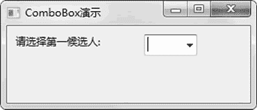
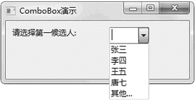
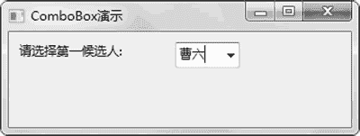

# wxPython ComboBox 下拉列表的用法

> 原文：[`www.weixueyuan.net/a/851.html`](http://www.weixueyuan.net/a/851.html)

ComboBox 本质是一个单选框，不同于普通的单选框，其占地比较小，而且可以用键盘输入来设定选中对象。

ComboBox 的初始化函数定义如下：

```

ComboBox(parent,
         id=ID_ANY,
         value=EmptyString,
         pos=DefaultPosition,
         size=DefaultSize,
         choices=[],
         style=0,
         validator=DefaultValidator,
         name=ComboBoxNameStr)
```

其中比较重要的属性是 value 和 choices。value 表示当前选中的值，choices 是可以选中的值，也就是备选项。

下面是投票候选人的一个例子，通过 ComboBox 列出候选人名单以供用户选择。下面的完整代码：

```

import wx
class ComboxFrameDemo1(wx.Frame):
  def __init__(self, p, t):
    wx.Frame.__init__(self,
                      id=wx.NewId(),
                      parent=p,
                      size=(300, 128),
                      title=t)
    panel = wx.Panel(self, -1)
    self.label1 = wx.StaticText(parent=panel,
                                id=-1,
                                size=(100, 18),
                                label=u"请选择第一候选人:",
                                pos=(10, 10))
    candidates = [u"张三", u"李四", u"王五", u"唐七", u"其他..."]
    self.combo1 = wx.ComboBox(parent=panel,
                              id=-1,
                              size=wx.DefaultSize,
                              pos=(160, 10),
                              value="",
                              choices=candidates,
                              name=u"候选人名单")
if __name__ == '__main__':
    app = wx.App(False)
    frame = ComboxFrameDemo1(None, "ComboBox 演示")
    frame.Show(True)
    app.MainLoop()
```

运行该程序后，显示图 1 所示的窗口。


图 1 下拉列表
可以使用鼠标来选中候选人，如图 2 所示。


图 2 鼠标操作下拉列表
也可以使用键盘输入任意的值，例如输入曹六如图 3 所示。


图 3 键盘输入内容到下拉列表