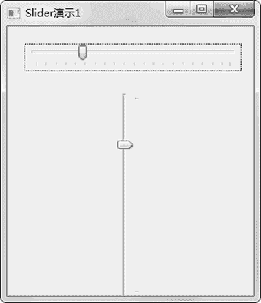

# wxPython Slider 滑块的用法

> 原文：[`www.weixueyuan.net/a/852.html`](http://www.weixueyuan.net/a/852.html)

Slider 滑块是可以通过拖动完成设置的元素，可以设定滑块的最小值（最左边或者最下面的代码的值）和最大值（最右边或者最上面代码的值），而且可以设置步长。

下面是 Slider 的初始化函数定义：

```

Slider(parent,                             # 父元素
       id=ID_ANY,                         # id，可以为-1
       value=0,                             # 初始值
       minValue=0,                        # 最小值
       maxValue=100,                     # 最大值
       pos=DefaultPosition,                 # 位置
       size=DefaultSize,                 # 大小
       style=SL_HORIZONTAL,                 # 风格，横向，纵向
       validator=DefaultValidator,         ＃ 检查值的有效性函数
       name=SliderNameStr)
```

下面的例子演示了一个窗口包含两个滑块的情况：

```

import wx
class SliderFrameDemo1(wx.Frame): 
    def __init__(self): 
        wx.Frame.__init__(self, None, -1,
                'Slider 演示 1',  
                size=(300, 350)) 
        panel = wx.Panel(self, -1) 
        self.count = 0 
        slider1 = wx.Slider(panel,
                -1,                              # id
                25,                               # 当前值
                1,                                # 最小值
                100,                              # 最大值
                pos=(20, 20),                   # 位置 
                size=(250, -1),                  # 大小
                # 水平滑块，wx.SL_HORIZONTAL 表明这是水平滑块
                style=wx.SL_HORIZONTAL | wx.SL_AUTOTICKS ) 
        slider1.SetTickFreq(5)
        slider2 = wx.Slider(panel,
                -1,
                25,
                1,
                100,
                pos=(125, 70), 
                size=(-1, 250),
                # 垂直滑块，wx.SL_VERTICAL 表示这是垂直滑块
                style=wx.SL_VERTICAL | wx.SL_AUTOTICKS ) 
        slider2.SetTickFreq(220)
if __name__ == '__main__':
    app = wx.App()
    frame = SliderFrameDemo1()
    frame.Show(True)
    app.MainLoop()
```

运行该程序后，可以看到图 1 所示的窗口。


图 1 滑块