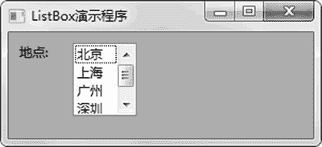

# wxPython ListBox 列表框的用法

> 原文：[`www.weixueyuan.net/a/854.html`](http://www.weixueyuan.net/a/854.html)

ListBox 列表框允许用户从列表中选中一个或者多个元素。

ListBox 的初始化函数定义如下：

```

ListBox(parent,
        id=ID_ANY,
        pos=DefaultPosition,
        size=DefaultSize,
        choices=[],
        style=0,
        validator=DefaultValidator,
        name=ListBoxNameStr)
```

下面是一个列表框的例子，该列表框包含 4 个候选项，用户可以单击任意一个来选中该候选项。这个例子中使用默认的属性，只能选中单个候选项，当选中了其他的候选项时，当前候选项就被取消选中了。

```

import wx
class MainFrame(wx.Frame):
  def __init__(self, p, t):
    wx.Frame.__init__(self, id=wx.NewId(), parent=p, title=t)
    self.label1 = wx.StaticText(parent=self,
                                id=-1,
                                size=(40, 58),
                                label=u"地点:",
                                pos=(10, 10))
    self.list1 = wx.ListBox(parent=self,
                            id=-1,
                            size=(60, 68),
                            pos=(60, 10),
                            style=wx.LB_EXTENDED,
                            choices=[u"北京", u"上海", u"广州", u"深圳"])
if __name__ == "__main__":
    app = wx.App(False)
    main_frame = MainFrame(None, u"ListBox 演示程序")
    main_frame.Show(True)                # 显示主窗口
    app.MainLoop()
```

运行后显示图 1 所示的窗口。


图 1 列表框

> 由于篇幅原因，这里不再对其他界面元素进行介绍。但 wxPython 的文档是比较详细的，而且接口也是比较直观的，所以在使用的过程中可以直接通过查看文档来得到需要的信息。