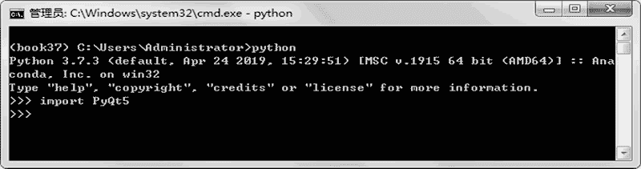
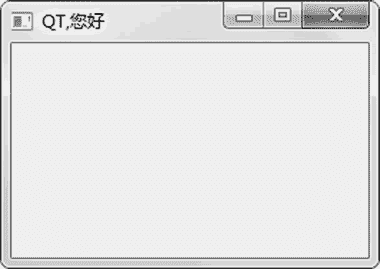
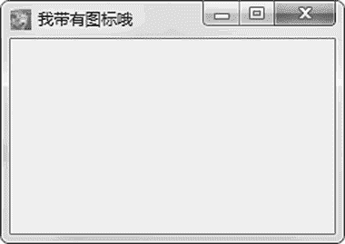

# Python PyQt5 安装和使用

> 原文：[`www.weixueyuan.net/a/855.html`](http://www.weixueyuan.net/a/855.html)

QT 是 Linux 桌面 KDE 的开发包，目前支持 Windows、macOS 和 Linux 等操作系统。

QT 的历史相当悠久，早在 1991 年，QT 就进入了开发阶段，不过那时的目标操作系统仅是安装有 X11 的 Linux 系统和 Windows。目前 QT 的大版本是 5，所以也被称作 QT5。QT 是一个 C++ 语言的开发包，本节介绍的是该开发包的 Python 版本，由于最新的 QT 版本是 5，所以该 Python 版的 QT 也被称作是 PyQt5。

在使用 PyQt 之前，首先需要安装该软件包，和以前一样，还是使用 pip 来安装。安装命令如下：

pip install PyQt5

> 目前最新版本是 5.12.2。

在安装完成后启动 Python 解释器，引入 PyQt5 这个包，看是否有异常抛出，如果没有即表示安装成功，如图 1 所示。


图 1 检查 PyQt5 是否安装成功

## PyQt 基本程序结构

PyQt 的基本结构和 wxPython 类似，也是需要创建一个应用程序，创建一个主窗口。应用程序接收命令行参数，可以用来配置应用程序。

下面是一个最简单的 PyQt5 程序：

```

import sys
from PyQt5.QtWidgets import QApplication, QWidget
if __name__ == '__main__':
    app = QApplication(sys.argv)         # 应用程序
    w = QWidget()                           # 主窗口
    w.resize(250, 150)                      # 设置窗口尺寸
    w.move(300, 300)                         # 设置窗口位置
    w.setWindowTitle(u'QT,您好')         # 设置窗口标题
    w.show()                                 # 显示窗口
    sys.exit(app.exec_())                # 程序退出是调用 app.exec_()
```

运行该程序，可以看到图 2 所示的窗口。


图 2 简单的 QT 窗口
和 wxPython 类似，可以为该窗口加上图标，方法是使用窗口的 setWindowIcon() 函数来设置。由于需要使用图标，所以需要引入 QIcon 模块。下面是完整的代码：

```

import sys
from PyQt5.QtWidgets import QApplication, QWidget
from PyQt5.QtGui import QIcon
if __name__ == '__main__':
    app = QApplication(sys.argv)         # 应用程序
    w = QWidget()                            # 主窗口
    w.resize(250, 150)                       # 设置窗口尺寸
    w.move(300, 300)                         # 设置窗口位置
    w.setWindowTitle(u'我带有图标哦')       # 设置窗口标题
    w.setWindowIcon(QIcon('dog.png'))     # 设置图标
    w.show()                                 # 显示窗口
    sys.exit(app.exec_())                # 程序退出是调用 app.exec_()
```

运行后可以看到如图 3 所示的窗口。


图 3 带有用户指定图标的 QT 窗口
PyQt 以其提供组件数量多闻名，据说包含有 200 多个组件，而且在网络上还有很多用户自己定义的组件。PyQt 不仅包含类似于 wxPython 的那些文本框、按钮等基本组件，还包含不少的高级组件，如日历、液晶数字显示等。有关这些组件的用法，后续章节会逐个做详细讲解。