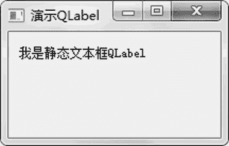

# PyQt5 QLabel 文本框的用法

> 原文：[`www.weixueyuan.net/a/859.html`](http://www.weixueyuan.net/a/859.html)

可以在 QLabel 组件上显示一行文字。

这里需要注意的是，QT 包含很多的模块，如数据库操作模块 SQL、网络操作模块 Network 等，而这里主要介绍的是图形界面模块 Widgets，在 PyQT 中用 PyQt5.QtWidgets 来表示该模块。QLabel 就属于该模块，其完整的名字是 PyQt5.QtWidgets.QLabel。

QLabel 组件的初始化函数很简单，就两个参数，一个是父组件对象；一个是配置属性，该参数可以为 None。完整定义如下：

QLabel(parent, flags)

下面建立一个仅包含一个静态文本框的窗口，完整代码如下：

```

import sys
from PyQt5.QtWidgets import QMainWindow, QApplication, QLabel
class QLabelDemo(QMainWindow):
    def __init__(self):
        super().__init__()
        self.initUI()
    def initUI(self):
        self.label = QLabel(self)
        self.label.setText(u"我是静态文本框 QLabel")
        self.label.setGeometry(10, 10, 260, 20)
        self.setWindowTitle(u'演示 QLabel')         # 设置窗口标题
        self.show()
if __name__ == '__main__':
    app = QApplication(sys.argv)
    ex = QLabelDemo()
    sys.exit(app.exec_())
```

运行该程序后，可以看到图 1 所示的窗口。


图 1 静态文本框