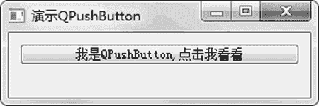
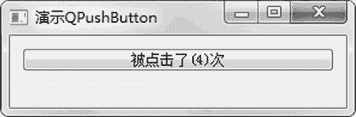

# PyQt5 QPushButton 按钮的用法

> 原文：[`www.weixueyuan.net/a/860.html`](http://www.weixueyuan.net/a/860.html)

QPushButton 组件的初始化函数默认有两个参数，一个是父组件对象，一个是按钮上显示的文字。下面是该初始化函数的定义：

QPushButton(str, parent: QWidget = None)

如果希望显示的是图片，那么可以传入三个参数，其中一个是图片信息，这种用法定义如下：

QPushButton(QIcon, str, parent: QWidget = None)

按钮的一个事件就 clicked，就是被用户鼠标左键单击了一下。可以通过调用该组件的 clicked 属性的 connect() 函数来定义该事件的处理方式。例如：

button_obj.clicked.connect(function_a)

下面是一个演示按钮的例子，在这个例子中，每次单击一下该按钮，按钮上的文字信息就发生改变，显示被单击的次数。完整代码如下：

```

import sys
from PyQt5.QtWidgets import QMainWindow, QApplication, QPushButton
class QLabelDemo(QMainWindow):
    def __init__(self):
        super().__init__()
        self.initUI()
    def onClick(self):
        self.click_num = self.click_num + 1
        button_text = u"被单击了(%d)次" % self.click_num
        self.button1.setText(button_text)
    def initUI(self):
        self.button1 = QPushButton(u"我是 QPushButton,单击我看看", self)
        self.button1.setGeometry(10, 10, 260, 20)
        self.click_num = 0
        # 如果被单击，处理函数是 self.onClick
        self.button1.clicked.connect(self.onClick)
        self.setWindowTitle(u'演示 QPushButton')         # 设置窗口标题
        self.resize(280, 60)
        self.show()
if __name__ == '__main__':
    app = QApplication(sys.argv)
    ex = QLabelDemo()
    sys.exit(app.exec_())
```

运行后显示图 1 所示的窗口。


图 1 普通按钮
单击按钮，可以发现按钮上的文字在发生改变，如入 2 所示。


图 2 单击按钮后的效果