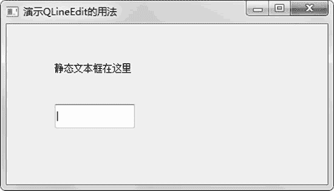
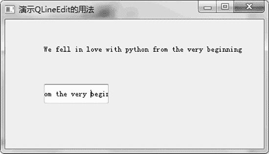

# PyQt5 QLineEdit 输入框的用法

> 原文：[`www.weixueyuan.net/a/863.html`](http://www.weixueyuan.net/a/863.html)

QLineEdit 输入框仅能输入一行文字，即使在其中按 Enter 键也没有效果。

下面的例子演示了单行输入框的用法，用户可以在其中编辑文本，文本内容将显示在上面的静态标签上。下面是这个例子的完整代码：

```

import sys
from PyQt5.QtWidgets import QMainWindow, QApplication, QLabel, QLineEdit
class QTLineEditExample(QMainWindow):
    def __init__(self):
        super().__init__()
        self.initUI()
    def initUI(self):                                # 初始化用户界面
        self.label_obj1 = QLabel(self)                # 静态标签
        self.label_obj1.setText(u"静态文本框在这里")
        self.line_edit_obj1 = QLineEdit(self)        # 单行编辑框
        self.line_edit_obj1.move(60, 100)
        self.label_obj1.move(60, 40)
        self.line_edit_obj1.textChanged[str].connect(self.onChanged)
        self.setGeometry(300, 300, 400, 200)
        self.setWindowTitle(u'演示 QLineEdit 的用法')
        self.show()
    def onChanged(self, text):
        self.label_obj1.setText(text)
        self.label_obj1.adjustSize()
if __name__ == '__main__':
    app = QApplication(sys.argv)
    ex = QTLineEditExample()
    sys.exit(app.exec_())
```

运行该程序，可以看到图 1 所示的窗口。


图 1 单行文本输入框
在 QLineEdit 单行输入框中输入内容，或者编辑内容，可以看到其内容都显示在上面的静态文本框中，如图 2 所示。


图 2 单行文本输入框的操作