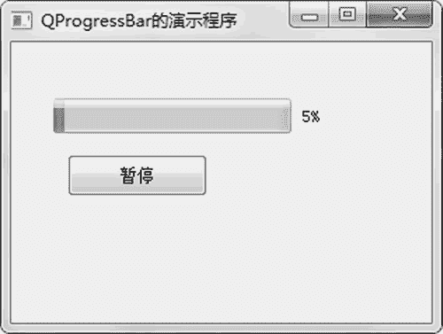

# PyQt5 QProgressBar 进度条的用法

> 原文：[`www.weixueyuan.net/a/864.html`](http://www.weixueyuan.net/a/864.html)

QProgressBar 进度条其实就是滑块，可以设置其最小值、最大值、当前值，也可以设置其方向，如横向或者竖向。

QProgressBar 初始化函数非常简单，仅一个参数 parent，表示父组件，其定义如下：

QProgressBar(parent: QWidget = None)

最大值可以通过该对象的函数 setMaximum() 来设置，定义如下：

setMaximum(self, int)

最小值可以通过该对象的函数 setMinimum() 来设置，定义如下：

setMinimum(self, int)

当前值可以通过该对象的函数 setMinimum() 来设置，定义如下：

setValue(self, int)

方向可以通过该对象的函数 setOrientation() 来设置，定义如下：

setOrientation(self, Qt.Orientation)

下面的例子包含一个进度条和一个按钮，最开始时按钮显示“开始”，如图 1 所示。


图 1 进度条
在单击按钮后，启动定时器，每 0.1 秒修改进度条的值，此时地按钮显示为“暂停”，如图 2 所示。


图 2 运行中的进度条
如果这时单击按钮，将暂停定时器，同时按钮显示为“继续”，如图 3 所示。


图 3 暂停中的进度条
如果这时单击按钮，会启动定时器，并且进度条会继续按照原来的速度向前走，直到进度条走到最右边，这时按钮显示“重新开始”，并且停掉定时器，如图 4 所示。


图 4 到了终点的进度条
如果这时单击按钮，进度条会重置为 0，按钮显示为“暂停”，就和第一次单击按钮时一样，如图 5 所示。


图 5 重新开始运行的进度条
下面是这个应用程序的完整代码：

```

import sys
from PyQt5.QtWidgets import QMainWindow, QApplication, \
    QPushButton, QProgressBar
from PyQt5.QtCore import QBasicTimer
class QProgressBarExample(QMainWindow):
    def __init__(self):
        super().__init__()
        self.init_ui()
    def init_ui(self):
        self.progressbar_obj1 = QProgressBar(self)
        self.progressbar_obj1.setGeometry(30, 40, 200, 25)
        self.button_obj1 = QPushButton(u'开始', self)
        self.button_obj1.move(40, 80)
        self.button_obj1.clicked.connect(self.on_button_clicked)
    self.timer_obj1 = QBasicTimer()
        self.step = 0
        # 窗口的大小,前面两个参数是位置信息
        # 后面两个参数是宽度和高度信息
        self.setGeometry(300, 300, 300, 200)
        self.setWindowTitle(u'QProgressBar 的演示程序')
        self.show()
    # 定时器处理函数
    def timerEvent(self, e):
        if self.step >= 100:
            self.timer_obj1.stop()
            self.button_obj1.setText(u'重新开始')
            return
        self.step = self.step + 1
        self.progressbar_obj1.setValue(self.step)
    def on_button_clicked(self):        # 按钮被单击后的处理函数
            # 已经走到头了，重新启动起来
        if self.progressbar_obj1.value() >= 100:
            self.step = 0
            self.progressbar_obj1.setValue(0)
            self.timer_obj1.start(100, self)
            self.button_obj1.setText(u'暂停')
        else:
            if self.timer_obj1.isActive():    # 如果正在运行中，那么暂停
                self.timer_obj1.stop()
                self.button_obj1.setText(u'继续')
            else:                            # 如果处于暂停状态，那么启动起来
                self.timer_obj1.start(100, self)
                self.button_obj1.setText(u'暂停')
if __name__ == '__main__':
    app = QApplication(sys.argv)
    main_win = QProgressBarExample()
    sys.exit(app.exec_())
```