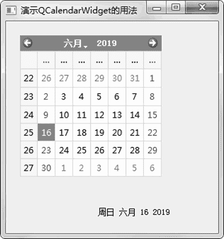
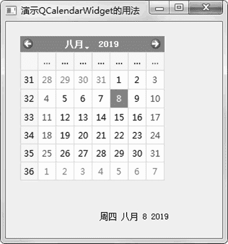

# PyQt5 QCalendarWidget 日历组件的用法

> 原文：[`www.weixueyuan.net/a/865.html`](http://www.weixueyuan.net/a/865.html)

QCalendarWidget 该组件可以用来选中日期和查看日期。

下面的例子演示了显示日期和得到用户选中的日期信息，其中通过定义回调函数 show_data() 来得到用户选中的日期信息，该回调函数在用户选中了不同的日期时被触发。下面是完整的代码：

```

import sys
from PyQt5.QtWidgets import QMainWindow, QCalendarWidget, QApplication
from PyQt5.QtWidgets import QLabel
from PyQt5.QtCore import QDate
class CalendarExample(QMainWindow):
    def __init__(self):
        super().__init__()
        self.init_ui()
    def init_ui(self):
        self.calendar_obj1 = QCalendarWidget(self)
        self.calendar_obj1.setGridVisible(True)
        # (20, 20)是位置
        # (200, 200)是大小
        self.calendar_obj1.setGeometry(20, 20, 200, 200)
        self.calendar_obj1.clicked[QDate].connect(self.show_data)
        self.label_obj1 = QLabel(self)
        date = self.calendar_obj1.selectedDate()
        self.label_obj1.setText(date.toString())
        self.label_obj1.setGeometry(130, 260, 200, 20)
        self.setGeometry(300, 300, 300, 300)
        self.setWindowTitle(u'演示 QCalendarWidget 的用法')
        self.show()
    def show_data(self, date):
        self.label_obj1.setText(date.toString())
if __name__ == '__main__':
    app = QApplication(sys.argv)
    main_win = CalendarExample()
    sys.exit(app.exec_())
```

运行该程序，可以看到图 1 所示的窗口。


图 1 日历组件
这时显示的是当前的日期，可以通过鼠标来选中其他日期，此时会发现下面静态标签的内容也会发生改变，内容是用户选中的日期信息，如图 2 所示。


图 2 选中某个日期