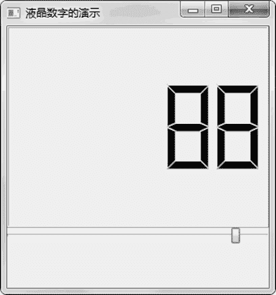

# PyQt5 QLCDNumber 组件：显示 LCD 数字显示

> 原文：[`www.weixueyuan.net/a/869.html`](http://www.weixueyuan.net/a/869.html)

QLCDNumber 组件用来显示一串阿拉伯数字，样式和电子表上的显示类似。

QLCDNumber 的初始化函数很简单，可以指定其父组件对象和初始值，如果没有指定初始值，则默认初始值是 0。下面是该初始化函数的定义：

```

QLCDNumber(parent: QWidget = None)
QLCDNumber(int, parent: QWidget = None)
```

这里主要是使用其 display() 函数来显示数字。对于不同的输入，其显示的样式是不同的，目前主要接收字符串输入、浮点数输入和整数输入。下面是这个函数的定义：

```

display(self, str)
display(self, float)
display(self, int)
```

下面是 QLCDNumber 组件使用的一个例子，在这个例子中，创建了一个滑块，用户可以拖动该滑块，这样就可以得到滑块的位置，并将该位置信息用 QLCDNumber 来显示出来。例如当前滑块的位置是 88，那么 QLCDNumber 就显示如图 1 所示的信息。


图 1 LCD 数字显示组件
下面是完整的代码：

```

import sys
from PyQt5.QtWidgets import QMainWindow, QApplication, QLCDNumber
from PyQt5.QtWidgets import QSlider, QVBoxLayout
from PyQt5.QtCore import Qt, QRect
class LCDNumberExample(QMainWindow):
    def __init__(self):
        super().__init__()
        self.init_ui()
    def init_ui(self):
        self.lcd_obj1 = QLCDNumber(self)
        self.slider_obj1 = QSlider(Qt.Horizontal, self)
        vbox = QVBoxLayout()
        vbox.addWidget(self.lcd_obj1)
        vbox.addWidget(self.slider_obj1)
        vbox.setGeometry(QRect(0, 0, 300, 250))
        self.setLayout(vbox)
        self.slider_obj1.valueChanged.connect(self.lcd_obj1.display)
        self.setGeometry(300, 300, 300, 300)
        self.setWindowTitle(u'液晶数字的演示')
        self.show()                    # 显示 UI 元素
if __name__ == '__main__':
    app = QApplication(sys.argv)
    main_win = LCDNumberExample()
    sys.exit(app.exec_())            # 在退出是调用 app.exec_()
```