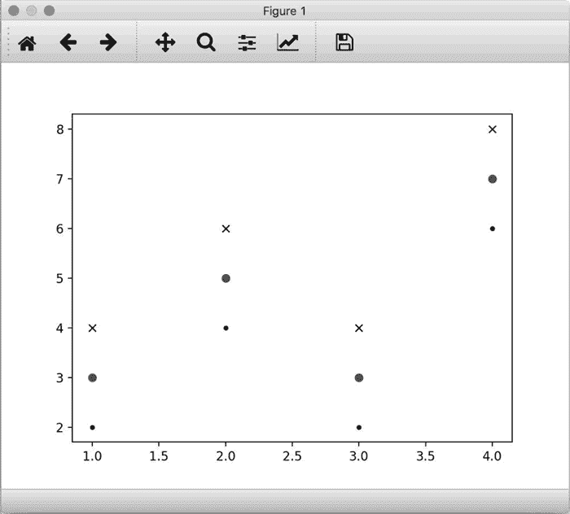

# Matplotlib 绘制散点图

> 原文：[`www.weixueyuan.net/a/872.html`](http://www.weixueyuan.net/a/872.html)

如果输入的是两个列表，一个表示 x 轴的值，一个表示 y 轴的值，那么就可以在直角坐标系中划出很多个点，然后将这些点用指定的线段连接起来就得到了散点图。

可以使用 plt.plot(x, y, 风格) 来达到目的，其中的风格有很多种，如点状、小叉、圆圈、不同颜色等。

例如有下面的脚本：

```

import matplotlib.pyplot as plt
x = [1, 2, 3, 4]
y = [2, 4, 2, 6]
y1 = [e+1 for e in y]
y2 = [e+2 for e in y]
plt.plot(x, y, "b.")                  # b：蓝色，.：点
plt.plot(x, y1, "ro")                  # r：红色，o：圆圈
plt.plot(x, y2, "kx")                 # k：黑色，x：x 字符(小叉)
plt.show()                            # 在窗口显示该图片
```

运行该脚本，可以得到如图 1 所示的散点图。


图 1 散点图
我们可以看到不同颜色、不同线型、不同的点的形状。

上述代码的第 9 行用来显示图片，但这并不是最好的使用方式。本章后面的部分会将产生的图片保存到 png 文件中。可以使用下面的代码来替换第 9 行的代码：

plt.savefig("demo1.png")