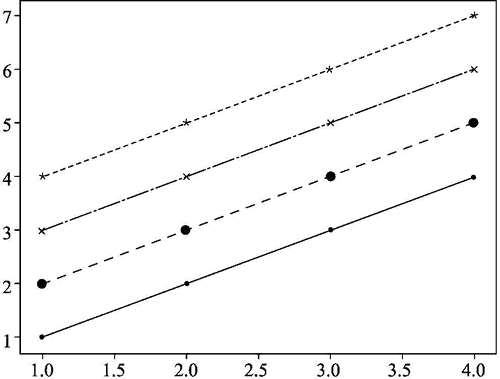

# Matplotlib 绘制折线图

> 原文：[`www.weixueyuan.net/a/873.html`](http://www.weixueyuan.net/a/873.html)

折线图和点状图类似，只是在风格上有所不同。我们需要指定线型，如“-”表示实线、“--”表示虚线、“-.”表示带点的虚线、“:”表示完全用点来组成的虚线。

下面的代码和前面的类似，不过风格部分有所不同：

```

import matplotlib.pyplot as plt
x  = [1, 2, 3, 4]
y  = [1, 2, 3, 4]
y1 = [e+1 for e in y]                # 计算 y 的值
y2 = [e+2 for e in y]
y3 = [e+3 for e in y]
plt.plot(x, y,  "b.-")               # b：蓝色，.：点，-：线
plt.plot(x, y1, "ro--")              # r：红色，o：圆圈，--：短线连接起来
plt.plot(x, y2, "kx-.")              # k：黑色，x：x 字符，-.：点和线
plt.plot(x, y3, "c*:")               # c：蓝绿色，*：*字符，:：点组成的线
plt.savefig("demo1.png")            # 将图片保存到文件中
```

运行该脚本可以生成一个图片文件，如图 1 所示。


图 1 matplotlib 绘制折线图
其实参数 x 是可选的，如果不填写，那么 x=[1,2,3,…]。例如上面的代码可以写成下面的样子，而含义没有任何差别：

```

import matplotlib.pyplot as plt
y  = [1, 2, 3, 4]            # 4 组数据
y1 = [e+1 for e in y]
y2 = [e+2 for e in y]
y3 = [e+3 for e in y]
plt.plot(y,  "b.-")           # 没有 x 参数
plt.plot(y1, "ro--")          # r：红色，o：圆圈，--：短线连接起来
plt.plot(y2, "kx-.")          # k：黑色，x：x 字符，-.：点和线
plt.plot(y3, "c*:")           # c：蓝绿色，*：*字符，:：点组成的线
plt.savefig("demo3.png")
```

颜色的表示法如表 2 所示。

表 2 颜色表示法对应的颜色

| 表示法 | 对应的颜色 |
| 'b' | 蓝色 |
| 'g' | 绿色 |
| 'r' | 红色 |
| 'c' | 蓝绿色 |
| 'm' | 品红 |
| 'y' | 黄色 |
| 'k' | 黑色 |
| 'w' | 白色 |

点的样式如表 3 所示。

表 3 点的样式

| 表示法 | 点的样式 |
| 'o' | 小圆圈 |
| 'v' | 朝下的三角形 |
| '^' | 朝上的三角形 |
| '>' | 朝右的三角形 |
| '<' | 朝左的三角形 |
| 'x' | 叉 |
| '+' | 加号 |
| 's' | 方框 |

线型的样式如表 4 所示。

表 4 线型的样式

| 表示法 | 线型的样式 |
| '-' | 实线 |
| '--' | 虚线 |
| '-.' | 带有点的虚线 |
| ':' | 点组成的虚线 |