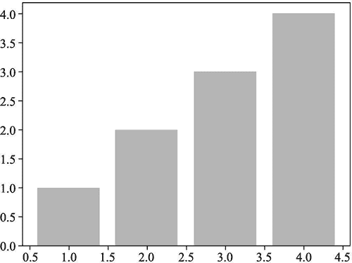
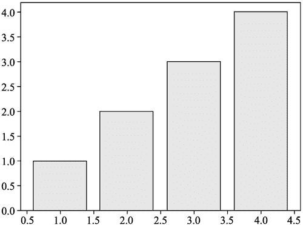
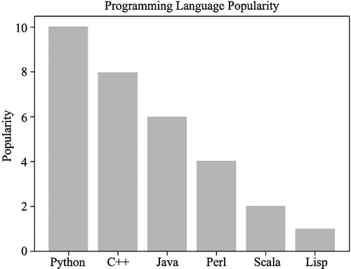
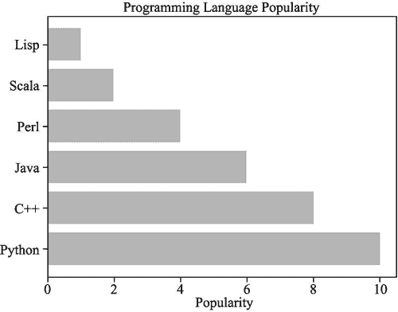

# Matplotlib 绘制柱状图

> 原文：[`www.weixueyuan.net/a/875.html`](http://www.weixueyuan.net/a/875.html)

柱状图和散点图类似，也是需要两个参数 x 和 y，但画出来的效果差别很大，而且需要使用 bar() 函数而不是 plot() 函数。

下面是一个最简单的例子：

```

import matplotlib.pyplot as plt
x  = [1, 2, 3, 4]
y  = [1, 2, 3, 4]
y1 = [e+1 for e in y]
y2 = [e+2 for e in y]
y3 = [e+3 for e in y]
plt.bar(x, y)
plt.savefig("bardemo1.png")
```

输出的图片如图 1 所示。


图 1 普通柱状图
可以修改柱体的颜色，通过参数 color 来完成。例如将以上代码的第 7 行进行如下修改：

plt.bar(x, y, color="red")

即可将柱状体修改为红色。

也可以设定柱体边框的颜色，通过参数 edgecolor 来完成。例如将以上代码的第 7 行修改为：

plt.bar(x, y, color="red", edgecolor="black")

即可将柱体边框设定为黑色，运行后得到的图片如图 2 所示。


图 2 带有边框的柱状图
x 轴除了可以是数字信息外，也可以是其他信息。例如可以用柱状图来表示几种编程语言的受欢迎程度，代码如下：

```

import matplotlib.pyplot as plt
language = ('Python', 'C++', 'Java', 'Perl', 'Scala', 'Lisp')
x_pos = range(len(language))  # [0, 1, 2, 3, 4, 5, 6]
pop = [10, 8, 6, 4, 2, 1]
plt.bar(x_pos, pop, align='center', alpha=0.5)
plt.xticks(x_pos, language)
plt.ylabel('Popularity')
plt.title('Programming Language Popularity)
plt.savefig("demo4.png")
```

运行该脚本，得到如图 3 所示的输出图片。


图 3 设定 x 轴的标签

## matplotlib 绘制水平柱状图

将柱状图中的 bar 改成 barh 即可，barh 表示 horizon bar，就是水平的柱状图。其用法和垂直的柱状图类似，下面是一个使用的例子：

```

import matplotlib.pyplot as plt
language = ('Python', 'C++', 'Java', 'Perl', 'Scala', 'Lisp')
x_pos = range(len(language))  # [0, 1, 2, 3, 4, 56]
pop = [10, 8, 6, 4, 2, 1]
plt.barh(x_pos, pop, align='center', alpha=0.5)
plt.yticks(x_pos, language)
plt.xlabel('Popularity')
plt.title('Programming Language Popularity')
plt.savefig("demo5.png")
```

运行该脚本，得到的输出图片如图 4 所示。


图 4 水平的柱状图