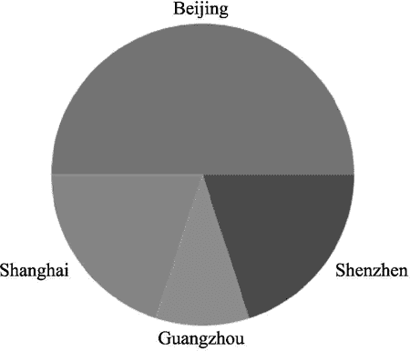
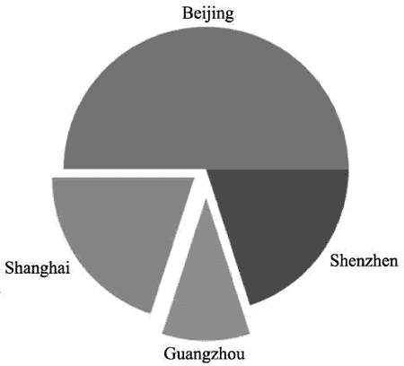
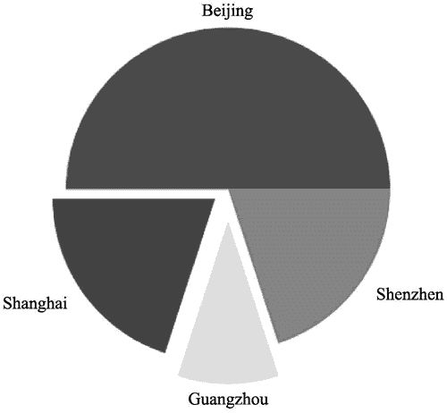

# Matplotlib 绘制饼图

> 原文：[`www.weixueyuan.net/a/876.html`](http://www.weixueyuan.net/a/876.html)

可以使用 pie() 函数来画饼图。下面是最简单的饼图，表示 4 个城市的高技术产值。

```

import matplotlib.pyplot as plt
lbs = ["Beijing", "Shanghai", "Guangzhou", "Shenzhen"]        # 标签
vals = [50, 20, 10, 20]
plt.pie(vals, labels=lbs)
plt.savefig("piedemo1.png")
```

运行该脚本，得到的输出图片如图 1 所示。


图 1 matplotlib 绘制饼图
也可以使用 explode 参数表示某个单元是否被切出来，以及切出来的长度。例如希望上海和广州被切出来，那么可以使用下面的代码：

```

import matplotlib.pyplot as plt
lbs = ["Beijing", "Shanghai", "Guangzhou", "shenzhen"]        # 标签
vals = [50, 20, 10, 20]
    # 0 表示不切出来，否则表示切出来，值越大切出的距离越大
explode = (0, 0.1, 0.2, 0)
plt.pie(vals, explode=explode, labels=lbs)
plt.savefig("piedemo2.png")
```

运行该脚本，输出的图片如图 2 所示。


图 2 切出来的饼图
也可以用 colors 参数来表示各个块的颜色，这也是一个字符串的列表，如下面的代码所示：

```

import matplotlib.pyplot as plt
lbs = ["Beijing", "Shanghai", "Guangzhou", "shenzhen"]
vals = [50, 20, 10, 20]                                # 值的列表
explode = (0, 0.1, 0.2, 0)                            # 切出的长度
color_list =['red', 'blue', 'yellow', 'gray']        # 颜色列表
plt.pie(vals, explode=explode, colors=color_list, labels=lbs)    # 饼图
plt.savefig("piedemo3.png")                            # 保存到 png 文件中
```

运行该脚本，得到的图片文件如图 3 所示。


图 3 指定饼图各个块的颜色