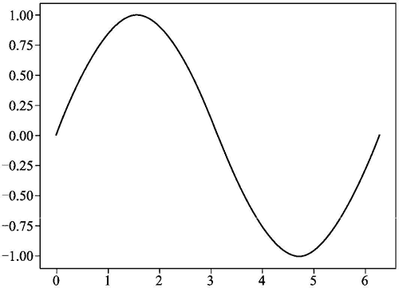
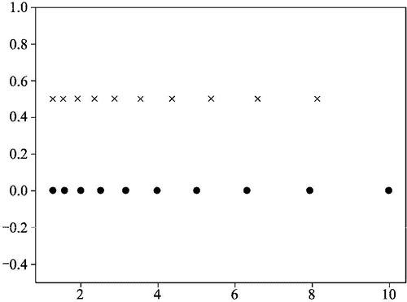
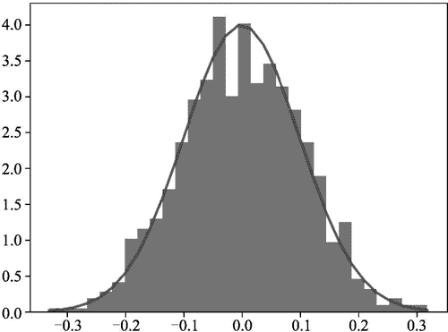

# Python NumPy 库的安装和使用

> 原文：[`www.weixueyuan.net/a/878.html`](http://www.weixueyuan.net/a/878.html)

NumPy 就是一个数学运算的库，其是用 C 语言实现的，所以运算速度非常快。该模块也不是 Python 自带的，需要自行安装。

可以使用 PIP 进行安装，命令如下：

pip install numpy

使用该模块之前需要将其引入，常用方法是：

import numpy as np

这样以后就可以使用 np 来表示该模块了。

NumPy 最常见的数据结构是 ndarray，ndarray 表示 N-dimentioanl Array，就是多维数组的意思。本节也从这里开始介绍 NumPy。

## ndarray 的构造

可以使用多种方式来构建多维数组，最常见的是使用列表来构建多维数组。下面的例子便使用一维列表构建了一个一维数组。

```

>>> import numpy as np
>>> nda1 = np.array([1, 2, 3])        # 使用一维列表来作为输入
>>> nda1                       
array([1, 2, 3])6    >>> type(nda1)
<class 'numpy.ndarray'>
```

如果希望构建二维数组，可以使用下面的方法：

```

>>> input_list = [
...     [1, 2, 3],
...     [4, 5, 6]
... ]
>>> nda2 = np.array(input_list)
>>> nda2
array([[1, 2, 3],                    # 查看值
       [4, 5, 6]])
>>> type(nda2)                        # 查看类型
<class 'numpy.ndarray'>
```

也可以指定一些特征值，让 NumPy 自动产生相关的数组。例如指定维度，让其产生所有元素都为 0 的数组，代码如下：

```

>>> np.zeros(5)                        # 5 个元素的一维数组
array([0., 0., 0., 0., 0.])
>>> np.zeros((5, 2))                # 二维数组，5 行，2 列
array([[0., 0.],
       [0., 0.],
       [0., 0.],
       [0., 0.],
       [0., 0.]])
```

也可以指定维度，让其产生所有元素值都为 1 的数组，代码如下：

```

>>> np.ones((5, 2))                    # 二维数组，5 行，2 列，所有元素都为 1
array([[1., 1.],
       [1., 1.],
       [1., 1.],
       [1., 1.],
       [1., 1.]])
>>> np.ones(5)                        # 一维数组，5 个元素
array([1., 1., 1., 1., 1.])
```

还可以让 NumPy 自动产生等差数组，此时需要指定开始值、结束值和步长。代码如下：

```

>>> np.arange(3,7,2)                # 从 3 开始，直到 7，步长为 2
array([3, 5])
>>> np.arange(3,7,1)                # 从 3 开始，直到 7，步长为 1
array([3, 4, 5, 6])
>>> np.arange(7, 3, -1)                # 从 7 开始，直到 3，步长为-1
array([7, 6, 5, 4])
>>> np.arange(7, 3, -2)                # 从 7 开始，直到 3，步长为-2
array([7, 5])
```

arange() 函数和 range() 类似，如果仅提供一个值，那么开始值是 0，步长是 1，代码如下：

```

>>> np.arange(7)
array([0, 1, 2, 3, 4, 5, 6])
如果提供两个参数，那么步长为 1：
>>> np.arange(2, 5)                # 从 2 开始，直到 5，步长为 1
array([2, 3, 4])
>>> np.arange(2, 6)                # 从 2 开始，直到 6，步长为 1
array([2, 3, 4, 5])
```

另外一个等差数列函数是 linspace()，其指定开始位置和结束位置，但不指定步长，而是指定元素个数。例如从 1 开始，到 5 结束，一共有 8 个数，那么生成的数组如下面所示：

```

>>> np.linspace(1, 5, 8)        # 包括 1 和 5，等分 8 个点
array([1\. , 1.57142857, 2.14285714, 2.71428571, 3.28571429,
     3.85714286, 4.42857143, 5])
```

可以发现元素个数和指定的一致，开始值和结束值也都被包含，而且它们的确是等差数列。

linspace() 函数比较有用，例如要画正弦函数在 0 到 2π 之间的图形，便可以使用该函数在 0 到 2π 之间产生均匀分布的 100 个点，然后使用 matplotlib 将它们画出来。下面是演示的代码：

```

import matplotlib.pyplot as plt
import numpy as np
x  = np.linspace(0, 2*np.pi, 100)
y  = [np.sin(e) for e in x]
plt.plot(x, y)
plt.savefig("sindemo1.png")
```

运行后产生的图片如图 1 所示。


图 1 y=sin(x)的曲线
还可以使用 logspace() 函数让 NumPy 自动产生等比数列，此时需要指定开始点和结束点，同时指定点的个数。如果没有提供点的数目，默认是生成 50 个点。

```

>>> np.logspace(2.0, 3.0, num=4)    # 4 个点，其实位置是 102，结束位置是 103
array([ 100\. , 215.443469,  464.15888336, 1000.])
```

下面是一个例子，其演示了 logspace() 的用法和参数 endpoint 的用法。endpoint=True 表示结束值被包含在输出数组中，否则表示不包含在输出数组中。下面是完整的代码：

```

import matplotlib.pyplot as plt
import numpy as np
N = 10            # 一共 10 个点
x1 = np.logspace(0.1, 1, N, endpoint=True)        # 10 被算作是最后一个点
x2 = np.logspace(0.1, 1, N, endpoint=False)    # 10 不被算作是最后一个点
y = np.zeros(N)
plt.plot(x1, y, 'o')
plt.plot(x2, y + 0.5, 'x')
plt.ylim([-0.5, 1])                                # y 轴的范围是-0.5 到 1
plt.savefig("logspace1.png")                    # 保存图片到文件
```

运行该脚本，得到的输出图片如图 2 所示。


图 2 logspace()的用法
还可以使用 full() 函数指定维度和一个值，让所有的元素都等于该值。该函数和 ones() 类似，但值是由用户指定的。

```

>>> np.full((2, 2), np.inf)                # 所有元素都是无穷大
array([[inf, inf],
       [inf, inf]])
>>> np.full((2, 2), 11)                    # 所有元素都是 11
array([[11, 11],
       [11, 11]])
>>> np.full((2, 2), 1.51)                # 所有元素都是 1.51
array([[1.51, 1.51],
       [1.51, 1.51]])
```

使用 eye() 函数还可以自动生成单位矩阵，就是仅对角线上的值为 1，其他位置上的值都为 0。

```

>>> np.eye(2)                                    # 2x2 的单位矩阵
array([[1., 0.],
       [0., 1.]])
>>> np.eye(3)                                    # 3x3 的单位矩阵
array([[1., 0., 0.],
       [0., 1., 0.],
       [0., 0., 1.]])
```

还可以自动产生随机的矩阵，例如可以使用 random.normal() 函数产生一个正态分布的一维矩阵：

```

>>> mu, sigma = 0, 0.1                    # mu 是平均值，sigma 代表分散程度
>>> s = np.random.normal(mu, sigma, 1000)
>>> s.size                                        # 元素个数为 1000
1000
>>> np.mean(s)                                    # 平均值接近 0
-0.0011152161285000821
>>> abs(mu - np.mean(s)) < 0.01                # 平均值接近 mu=0
True
>>> abs(sigma - np.std(s, ddof=1)) < 0.01        # 分散程度检查
True
```

可以将生成的数据画出来，使用下面的代码：

```

import matplotlib.pyplot as plt
import numpy as np
mu, sigma = 0, 0.1
s = np.random.normal(mu, sigma, 1000)
count, bins, ignored = plt.hist(s, 30, density=True)
plt.plot(bins, 1/(sigma * np.sqrt(2 * np.pi)) *
         np.exp( - (bins - mu)**2 / (2 * sigma**2) ),
         linewidth=2, color='r')
plt.savefig("rand1.png")
```

运行该脚本，得到的输出图片文件如图 3 所示。


图 3 正态分布
还可以生成完全随机的矩阵，方法是使用 np.random.rand（外形）函数。例如在下面的例子中，就生成了随机内容组成的指定外形的矩阵。

```

>>> np.random.rand(3,2)                    # 3x2 的二维矩阵
array([[0.11319256, 0.84668147],
       [0.4040353 , 0.70912343],
       [0.6511614 , 0.80706271]])
>>> np.random.rand(3,2,2)                # 3x2x2 的三维矩阵
array([[[0.64851863, 0.3895985 ],
        [0.63038544, 0.58402249]],
       [[0.39816687, 0.92149102],
        [0.07113285, 0.17109903]],
       [[0.06713956, 0.39415293],
        [0.06125844, 0.71276929]]])
>>> np.random.rand(4)                    # 一维矩阵
array([0.11918788, 0.91847982, 0.29599804, 0.42242323])
```