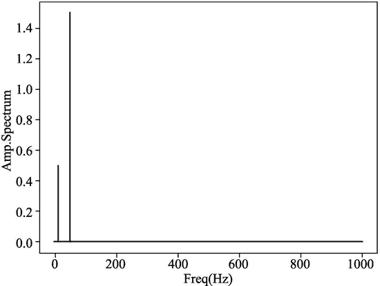

# NumPy 中的傅里叶变换

> 原文：[`www.weixueyuan.net/a/882.html`](http://www.weixueyuan.net/a/882.html)

傅里叶变换是将时域数据转换成频域数据。例如周期为 25 的正弦波可以用下面的函数来表示：

y=sin(2π*f*x)=sin(50πx)

如果以 150Hz 的采样频率来采样，也就是在 0 到 1 之间有 150 个采样点，那么其时间列表，即公式中的 x 的列表如下：

[0.         0.00666667 0.01333333 0.02       0.02666667 0.03333333
0.04       0.04666667 0.05333333 0.06       0.06666667 0.07333333
…. 省略中间数据
0.88       0.88666667 0.89333333 0.9        0.90666667 0.91333333
0.92       0.92666667 0.93333333 0.94       0.94666667 0.95333333
0.96       0.96666667 0.97333333 0.98       0.98666667 0.99333333]

得到的输出列表，即 y 的列表如下：

[ 0.00000000e+00  8.66025404e-01  8.66025404e-01  1.22464680e-16
-8.66025404e-01 -8.66025404e-01 -2.44929360e-16  8.66025404e-01
…. 省略中间数据
  2.25434048e-14  8.66025404e-01  8.66025404e-01 -1.17627991e-14
-8.66025404e-01 -8.66025404e-01]

将这些数据画成一个图，就如图 1 所示。


图 1 y=sin(50πx)的时域图
如何将它们转换成频域图呢？很简单，只需将 y 输入到 np.fft.fft() 函数即可。下面是实现的代码：

```

import numpy as np
import matplotlib.pyplot as plt
from numpy.fft import fft,ifft
# x 是时域值
# y 是频域值
# time_span 是采样时长
def show(x, ft, time_span = 5):
    n = len(x)                                 # 采样点个数
    interval = time_span / n
    frequency = np.arange(n / 2) / (n * interval)
    nfft = abs(ft[range(int(n / 2))] / n )
    plt.plot(frequency, nfft, 'red')
    plt.xlabel('Freq (Hz)'), plt.ylabel('Amp. Spectrum')
    #plt.show()
    plt.savefig("fftv2_1_1.png")
time = np.arange(0, 5, .005)
x = np.sin(2 * np.pi * 10 * time)           # 时域信号
y = np.fft.fft(x)                              # 频域信号
show(x, y, 5)
```

运行该脚本，得到的输出图片如图 2 所示。


图 2 y=sin(10πx)的频域图
如果输入信号中带有两个不同幅度的正弦信号，例如输入信号为：

y=sin(2*10πx)+3sin(2*50πx)

它们的时域图如图 3 所示。


图 3 y=sin(2*10πx)+3sin(2*50πx)的时域图
那么它们的傅里叶变换代码如下：

```

import numpy as np
import matplotlib.pyplot as plt
from numpy.fft import fft, ifft
# x 是时域值
# y 是频域值
# time_span 是采样时长
def show(x, ft, time_span = 5):
    n = len(x)                                 # 采样点个数
    interval = time_span / n
    frequency = np.arange(n / 2) / (n * interval)
    nfft = abs(ft[range(int(n / 2))] / n )
    plt.plot(frequency, nfft, 'red')
    plt.xlabel('Freq (Hz)'), plt.ylabel('Amp. Spectrum')
    #plt.show()
    plt.savefig("fftv2_1_2.png")
time = np.arange(0, 5, .0005)
x0 = np.sin(2 * np.pi * 10 * time)           # 10HZ
x1 = 3 * np.sin(2 * np.pi * 50 * time)       # 30HZ
x = x0 + x1                                  # 时域信号
y = np.fft.fft(x)                               # 频域信号
show(x, y, 5)
```

运行该脚本，得到的输出图片如图 4 所示。


图 4 y=sin(2*10πx)+3sin(2*50πx)的频域图
反变换也很简单，下面便是一个反变换的例子代码：

```

import numpy as np
import matplotlib.pyplot as plt
from numpy.fft import fft,ifft
# 在 0 到 2π之间取 50 个点
x = np.linspace(0, 2*np.pi, 50)
wave = np.cos(x)                                   # 时域的值
transformed=np.fft.fft(wave)                     # 傅里叶变换
reversed_data = np.fft.ifft(transformed)        # 反变换
plt.plot(x, wave, 'r')
# 反变换出来的值+0.2，以免和变换之前的值重合
plt.plot(x, reversed_data.real+0.2, 'b')
plt.savefig("fft4.png")
```

运行该脚本，可以得到如图 5 所示的时域图，其中上面那条曲线是傅里叶变换后再傅里叶反变换并向上移动 0.2 的曲线；下面那条曲线是 y=cos(x) 的曲线。可以发现傅里叶变换后再次反变换得到的曲线近似于输入的曲线。


图 5 y=cos(x)和 y=ifft(fft(cos(x)))的时域图