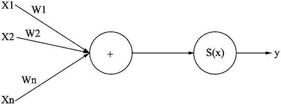
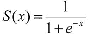
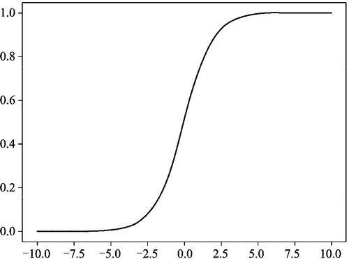
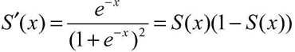
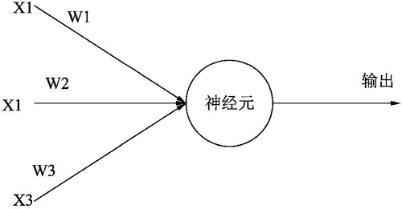

# Numpy 在神经网络中的应用

> 原文：[`www.weixueyuan.net/a/883.html`](http://www.weixueyuan.net/a/883.html)

最近深度学习非常热门，深度学习就是使用多层的神经网络来解决问题的一种方法。

在 20 世纪，人们认为任何神经网络都可以等效于某个 3 层的神经网络，这样就没有必要去研究多层的神经网络。直到最近几年人们才意识到多层神经的独特用途，其在图片识别、博弈等方面有着很大的优势。但不论是多少层的神经网络，其基本工作单元都是神经元，通过多个神经的不同连接方式来搭建不同的神经网络，从而解决不同的问题。

本节将介绍神经元和最简单的神经网络，以及基本的神经网络参数训练。

由于神经网络是由很多的神经元组成，神经元又是由多个输入和一个输出组成，而对于前向神经网络，最终输出和输入之间的关系基本可以用一个矩阵来表示，这和 NumPy 的基本数据结构 ndarray 是很一致的，所以很多 NumPy 的方法也可以用在神经网络技术上。

每个神经元有 n 个输入 x，一个输出 y，输出和输入的关系可以用下面的数学公式表示

y=S(m)
m=w[1]x[2]+w[2]x[2]+...+w[n]x[n]

简单来说就是对所有输入求一个加权和，然后通过 S(x) 这个函数输出出来，不同的加权和标识不同的神经网络。我们也可以用图 1 来表示神经元的基本形式。


图 1 神经元的基本形式
S(x) 这个函数一般来说是固定的，主要是为了将 y 的输出范围压缩到指定的范围。常用的 S(x) 是 Sigmoid 函数，该函数定义如下：


可以使用下面的代码来画出该函数输入 x 和输出 y 的关系：

```

import numpy as np
import matplotlib.pyplot as plt
x = np.arange(-10,10,0.01)
y = 1.0/(np.exp(x*-1.0)+1.0)
plt.plot(x, y, 'b')  # 画图
plt.savefig("sigmod1.png")
```

运行该脚本，输入的图片如图 3 所示。


图 3 Sigmoid 函数
我们可以发现其规律如下：曲线是平滑的；输出 y 随输入 x 单调递增；输出 y 的范围是 0～1；当 x 超出 -5～5 这个范围，输出 y 基本等于 0 或者 1，和数字信息一致。由于有这些特性，Sigmoid 函数被广泛应用在各种神经元。

该函数还有一个特别的地方，就是求导特别方便，下面是其导数计算公式：


在训练模型的过程中，如果发现对于输入 x，输出 y 和目标输出 y0 存在差别 ∆y，就需要调整权重 w 来消除这种差别。方法就是找到 ∆w，让新的 w'=w+∆w。

该如何找到这个 ∆w 呢？这时就需要求导了，我们需要知道 y 对 w 的在当前 x 位置的导数 ∂，∆y=∆w∂，由于知道了 ∆y 和 ∂，便可以求出 ∆w。但在实际应用中我们并不会使用这个 ∆w，而是自己定义一个固定的步长 s。∂ 的作用是规定了移动的方向，s 确定了移动的长度，结合 s 和 ∂ 可以让 ∆y 变小。

按照这种方式多次迭代就可以让 ∆y 趋近于 0。这个过程就是模型训练，训练的目的就是调整权重 w 以消除 ∆y。∆y 也叫损失函数，就是真实输出和期待输出之间的差别。这种计算 ∂ 的办法也叫作梯度下降法，就是确定某个位置 x 最快下降方向。

在实际应用中，网络非常复杂，包含的神经元个数庞大，神经元之间的连接方式也是数量庞大。为了演示神经网络的使用，不太可能拿实际使用情况作为例子，这里仅以单个神经元组成的神经网络作为例子。该神经元有 3 个输入，输入基本就是 0 和 1；该神经元有一个输出，输出也只有 0 和 1 两个值，它们可以用图 5 表示。


图 5 神经元的输入和输出
该神经元的输入和输出的关系如表 6 所示。

表 6 神经网络期待结果

| 输 入 | 输 出 |
| 输入 X[1] | 输入 X[2] | 输入 X[3] |
| 0 | 0 | 1 | 0 |
| 1 | 1 | 1 | 1 |
| 1 | 0 | 1 | 1 |
| 0 | 1 | 1 | 0 |

这里使用单个神经元来达到设计目的。由于仅有一个神经元，所以参数个数也就只有 3 个，分别是 w1、w2 和 w3。我们的任务就是通过给代码输入期望的结果来训练这 3 个参数。

下面是完整的训练和验证代码：

```

import numpy as np
class NeuralNetwork():
  def __init__(self):
    # 设置随机数种子
    np.random.seed(1)
    # 将权重转化为一个 3x1 的矩阵，其值分布为-1~1，并且均值为 0
    self.weights = 2 * np.random.random((3, 1)) - 1
  def sigmoid(self, x):
    # 应用 Sigmoid 激活函数
    return 1 / (1 + np.exp(-x))
  def sigmoid_derivative(self, x):
    #计算 Sigmoid 函数的偏导数
    return x * (1 - x)
  def train(self, training_inputs, training_outputs, iterations_num):
    # 训练模型
    # 输入是 training_inputs，是一个二维矩阵
    # 期待值是 training_outputs，是一个一维矩阵
    # iterations_num 是迭代的次数
    for iteration in range(iterations_num):
      # 得到输出
      output = self.think(training_inputs)
      # 计算误差
      error = training_outputs - output
      # 微调权重
      adjustments = np.dot(training_inputs.T, error * self.sigmoid_
           derivative(output))
      self.weights += adjustments
  def think(self, inputs):
    # 基于当前参数，计算 inputs 的输出
    inputs = inputs.astype(float)
    output = self.sigmoid(np.dot(inputs, self.weights))
    return output
if __name__ == "__main__":
  # 初始化神经类
  neural_network = NeuralNetwork()
  print(u"随机生成最初的权重值")
  print(u"初始权重值为：", neural_network.weights)
  #训练数据的输入部分
  training_inputs = np.array([[0,0,1],
                              [1,1,1],
                              [1,0,1],
                              [0,1,1]])
  # 训练数据的输出
  training_outputs = np.array([[0,1,1,0]]).T
  # 开始训练，进行 150000 次训练
  neural_network.train(training_inputs, training_outputs, 15000)
  print(u"训练后的权重：", neural_network.weights)
  # 验证结果
  y = neural_network.think(np.array(training_inputs[0]))
  assert abs(y - training_outputs[0]) < 1e-2
  y = neural_network.think(np.array(training_inputs[1]))
  assert abs(y - training_outputs[1]) < 1e-2
  y = neural_network.think(np.array(training_inputs[2]))
  assert abs(y - training_outputs[2]) < 1e-2
  y = neural_network.think(np.array(training_inputs[3]))
  assert abs(y - training_outputs[3]) < 1e-2
  print(u"验收通过")
```

运行该脚本后的输入如下：

$ python ex1.py
随机生成最初的权重值
初始权重值为： [[-0.16595599]
[ 0.44064899]
[-0.99977125]]
训练后的权重： [[10.08740896]
[-0.20695366]
[-4.83757835]]
验收通过

可以发现，其实训练就是调整权重参数的一个过程。虽然不知道最终我们期望的参数是多少，但是可以通过比较实际输出和期望输出的差值来微调这些权重，最终可以达到输出和我们的期望一致。