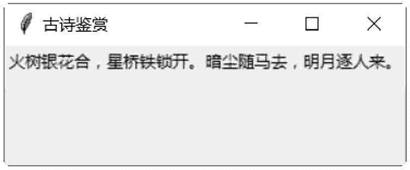
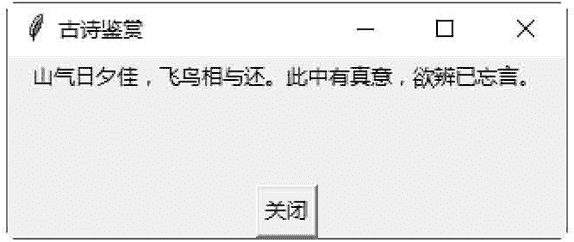

# 第一个 Tkinter 程序

> 原文：[`www.weixueyuan.net/a/523.html`](http://www.weixueyuan.net/a/523.html)

tkinter 是 Python 的标准 GUI 库，Python 使用 tkinter 可以快速创建 GUI 应用程序。

由于 tkinter 是内置到 python 安装包中的，因此只要安装好 Python 之后就能加载 tkinter 库。对于简单的图形界面，使用 tkinter 库可以轻松完成。

## 1.第一个 tkinter GUI 程序

因为当安装好 Python 3.7 时，tkinter 也会随之安装好，所以用户要使用 tkinter 的功能，只需要加载 tkinter 模块即可。代码如下：

import tkinter

下面示例是使用 tkinter 库创建第一个简单的图形用户界面，代码如下：

```

import tkinter
win = tkinter.Tk()
win.title (string ="古诗鉴赏")
b = tkinter.Label (win, text="火树银花合，星桥铁锁开。暗尘随马去，明月逐人来。")
b.pack()
win.mainloop()
```

示例代码分析如下：

*   第 1 行：加载 tkinter 模块。
*   第 2 行：使用 tkinter 模块的 Tk() 方法创建一个主窗口。win 是此窗口的句柄。如果用户调用多次 Tk() 方法，就可以创建多个主窗口。
*   第 3 行：使用用户界面的标题为“古诗鉴赏”。
*   第 4 行：使用 tkinter 模块的 Label() 方法，在窗口内创建一个标签控件。其中，参数 win 是该窗口的句柄；参数 text 是标签控件的文字，Label() 方法返回此标签控件的句柄。注意，tkinter 也支持 Unicode 字符串。
*   第 5 行：调用标签控件的 pack() 方法设置窗口的位置、大小等选项。后面将会详细讲述 pack() 方法的使用。
*   第 6 行：开始窗口的事件循环。

保存并运行程序，结果如图 1 所示：


图 1：程序运行结果
如果想要关闭此窗口，那么只要单击窗口右上方的关闭按钮即可。

## 2\. 让 thinter 程序独立运行

如果想让 GUI 应用程序能够在 Windows 下单独执行，就必须将程序代码存储为 .pyw 文件，这样就可以使用 pythonw.exe 来执行 GUI 应用程序，而不必打开 Python 解释器。如果将程序代码存储为 .py 文件，就必须使用 python.exe 执行 GUI 应用程序，如此会打开一个 MS-DOS 窗口。

包含带关闭按钮的图形界面程序：

```

from tkinter import *
win = Tk()
win.title(string="古诗鉴赏")
Label(win,text="山气日夕佳，飞鸟相与还。此中有真意，只是已忘言").pack()
Button(win,text="关闭",command=win.quit).pack(side="bottom")
win.mainloop()
```

代码分析如下：

*   第 1 行：加载 tkinter 模块的所有属性，如此可以直接使用 tkinter 模块的属性名称。
*   第 2 行：使用 tkinter 模块的 Tk() 方法创建一个主窗口。win 是此窗口的句柄。
*   第 3 行：使用用户界面的标题为“古诗鉴赏”。
*   第 4 行：使用 tkinter 模块的 Label() 方法，在窗口内创建一个 Label 控件。其中，参数 win 是该窗口的句柄；参数 text 是 Label 控件的文字，并调用 Label 控件的 pack() 方法设置 Label 控件的位置在窗口的顶端（默认值）。
*   第 5 行：使用 tkinter 模块的 Button() 方法，在窗口内创建一个 Button 控件。其中，参数 win 是该窗口的句柄；参数 text 是 Button 控件的文字；参数 command 是单击该按钮后结束窗口，并调用 Button 控件的 pack() 方法设置 Button 控件的位置在窗口的底端。
*   第 6 行：开始窗口的事件循环。

将以上代码保存 demo.pyw 文件后，直接双击运行该文件，结果下图所示。


图 2：程序运行结果
单击“关闭”按钮，即可将该用户界面窗口关闭。