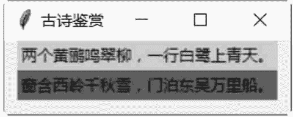
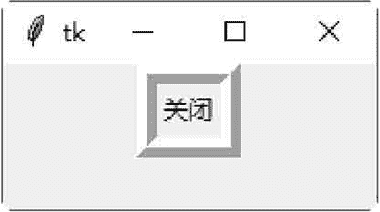
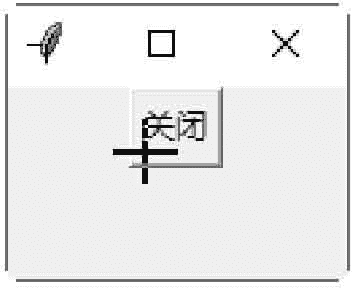
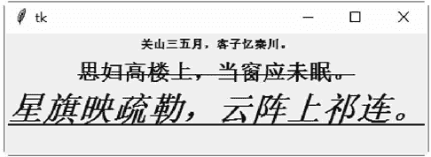
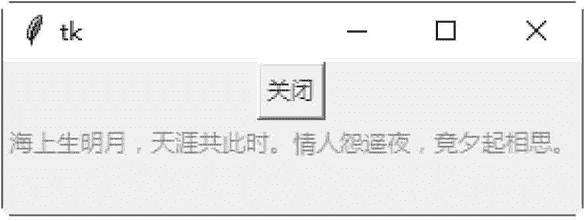

# Tkinter 常用控件及其属性汇总

> 原文：[`www.weixueyuan.net/a/534.html`](http://www.weixueyuan.net/a/534.html)

tkinter 包含 15 个 tkinter 控件，如表 1 所示。

tkinter 常用控件

| 控件名称 | 说明 |
| Button | 按钮控件，在程序中显示按钮 |
| Canvas | 画布控件，用来画图形，如线条及多边形等 |
| Checkbutton | 多选框控件，用于在程序中提供多项选择框 |
| Entry | 输入控件，定义-一个简单的文字输入字段 |
| Frame | 框架控件，定义一个窗体，以作为其他控件的容器 |
| Label | 标签控件，定义一个文字或图片标签 |
| Listbox | 列表框控件，定义一个下拉方块 |
| Menu | 菜单控件，定义一个菜单栏、下拉菜单和弹出菜单 |
| Menubutton | 菜单按钮控件，用于显示菜单项 |
| Message | 消息控件，定义一个对话框 |
| Radiobutton | 单选按钮控件，定义一个单选按钮 |
| Scale | 范围控件，定义一个滑动条，以帮助用户设置数值 |
| Scrollbar | 滚动条控件，定义-一个滚动条 |
| Text | Text 文本控件，定义一个文本框 |
| Topleve | 此控件与 Frame 控件类似，可以作为其他控件的容器。但是此控件有自己的最上层窗口，可以提供窗口管理接口 |

控件都有以下共同的属性：

#### 1) anchor

定义控件在窗口内的位置或文字信息在控件内的位置。可以是 N、NE、E、SE、S、SW、W、NW 或 CENTER。

#### 2) background(bg)

定义控件的背景颜色，颜色值可以是颜色名称常数，也可以是 "#rrggbb" 形式的数字。用户可以使用 background 或 bg。

下面的示例是定义一个背景颜色为绿色的文字标签，以及一个背景颜色为 SystemHightlight 的文字标签。

```

#设置 Label 控件颜色
from tkinter import *
win = Tk() 
win. title (string ="古诗鉴赏")
Label (win, background="#00ff00 ", text="两个黄鹏鸣翠柳，一行白鹭上青天。").pack ()
Label (win, background="SystemHighlight", text="窗含西岭千秋雪，泊东吴万里船。").pack()
win.mainloop() 
```

保存后，直接双击运行，结果如图 1 所示：


图 2：程序运行结果

#### 3) bitmap

定义显示在控件内的 bitmap 图片文件。

#### 4) borderwidth

定义控件的边框宽度，单位是像素。

下面的示例是定义一边框宽度为 13 个像素的按钮。

```

from tkinter import *
win = Tk()
Button(win, relief=RIDGE, borderwidth=13, text="关闭",command=win.quit).pack() 
win.mainloop()
```

结果如图 2 所示:
图 2：程序运行结果

#### 5) command

当控件有特定的动作发生时，如单击按钮，此属性定义动作发生时所调用的 Python 函数。 下面的示例是定义单击按钮时，即调用窗口的 quit() 函数来结束程序：

```

from tkinter import *
win =Tk()
win.title (string ="结束程序")
Button (win, text="关闭",command=win.quit).pack()
win.mainloop()
```

#### 6) cursor

定义当鼠标指针移到控件上时，鼠标指针的类型。可使用的鼠标指针类型有 crosshair、watch、xterm、fleur 及 arrow。

```

from tkinter import *
win = Tk()
Button (win, cursor='crosshair',text='关用', command=win.quit).pack ()
win.mainloop()
```

结果如图 3 所示。


图 3：程序运行结果

#### 7) font

如果控件支持标题文字，就可以使用此属性来定义标题文字的字体格式。此属性是一个元组格式：（字体，大小，字体样式），字体样式可以是 bold、italic、underline 及 overstrike。用户可以同时设置多个字体样式，中间以空白隔开。

下面的示例是定义三个文字标签的字体。

```

#设置文本标签的字体
from tkinter import *
win=Tk()
Label (win, font= ("Times" , 8, "bold"),text="关山三五月，客子忆秦川。" ).pack ()
Label (win, font= ("Symbol", 16, "bold overstrike"), text="思妇高楼上，当窗应未眠。").pack()
Label (win, font=("细明体",24, "bold italic underline") , text="星旗映疏勒，云阵 上祁连。").pack ()
win.mainloop()

```

保存 demo.pyw 文件后，直接双击运行该文件，结果如图 4 所示：


图 4：程序运行结果

#### 8) foreground(fg)

定义控件的前景（文字）颜色，颜色值可以是表中的名称，也可以是"#rrggbb"形式的数字。可以使用 foreground 或 fg。 下面的示例是定义一个文字颜色为红色的按钮，以及一个文字颜色为绿色的文字标签。

```

from tkinter import *
win = Tk()
Button(win, foreground="#ff0000",  text="关闭",command=win.quit).pack()
Label (win, foreground="SystemHighlightText",text="海上生明月,天涯共止匕日寸。'情人 怨遥夜,竟夕起相思。").pack()
win .mainloop()
```

保存为 demo01.pyw 文件后，直接双击运行该文件，结果如图 5 所示。


图 5：程序运行结果

#### 9) height

如果是 Button、Label 或 Text 控件，此属性定义以字符数目为单位的高度。其他的控件则是定义以像素 pixel 为单位的高度。 下面的示例是定义一个字符高度为 5 的按钮：

```

from tkinter import *
win = Tk()
Button(win, height=5,text="关闭",command=win.quit).pack()
win.mainloop()
```

#### 10) highlightbackground

定义控件在没有键盘焦点时，画 hightlight 区域的颜色。

#### 11) highlightcolor

定义控件在有键盘焦点时，画 hightlight 区域的颜色。

#### 12) highlightthickness

定义 hightlight 区域的宽度，以像素为单位。

#### 13）image

定义显示在控件内的图片文件。

#### 14) justify

定义多行文字标题的排列方式，此属性可以是 LEFT、CENTER 或 RIGHT。

#### 15) padx 与 pady

定义控件内的文字或图片与控件边框之间的水平和垂直距离。下面的示例是定义按钮内文字与边框之间的水平距离为 20 像素，垂直距离为 40 像素。

```

from tkinter import *
win = Tk()
Button (win, padx=20, pady=40,text="关闭",command=win.quit).pack ()
win.mainloop ()
```

#### 16) relief

定义控件的边框形式。所有的控件都有边框，不过有些控件的边框默认是不可见的。如果是 3D 形式的边框，那么此属性可以是 SUNKEN、RIDGE、RAISED 或 GROOVE；如果是 2D 形式的边框，那么此属性可以是 FLAT 或 SOLID。 下面的示例是定义一个平面的按钮。

```

from tkinter import *
win = Tk()
Button(win, relief=FLAT, text="关闭",command=win.quit).pack()
win.mainloop()
```

#### 17) text

定义控件的标题文字。

#### 18) variable

将控件的数值映像到一个变量。当控件的数值改变时，此变量也会跟着改变。同样地，当变量改变时，控件的数值也会跟着改变。此变量是 StringVar 类、IntVar 类、DoubleVar 类及 BooleanVar 的实例变量，这些实例变量可以分别使用 get() 与 set() 方法读取与设置变量。

#### 19) width

如果是 Button、Label 或 Text 控件，此属性定义以字符数目为单位的宽度。其他控件则是定义以像素 pixel 为单位的宽度。

下面的示例是定义一个字符宽度为 16 的按钮。

```

from tkinter import *
win = Tk()
Button (win, width=16, text="关闭", command=win.quit).pack()
win.mainloop()
```