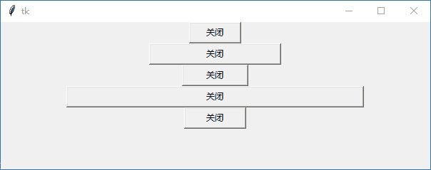

# Tkinter 控件的颜色和大小

> 原文：[`www.weixueyuan.net/a/537.html`](http://www.weixueyuan.net/a/537.html)

在 Tkinter 中，可以对控件的颜色和大小进行设置。

#### 控件颜色

如果用户是在 Windows 操作系统内使用 tkinter，就可以使用如下表所定义的颜色名称常数：

Windows 操作系统的颜色名称常数

| SystemActiveBorder | SystemActiveCaption | SystemAppWorkspace |
| SystemBackground | SystemButtonFace | SystemButtonHighlight |
| SystemButtonShadow | SystemButtonText | SystemCaptionText |
| SystemDisabledText | SystemHighlight | SystemHighlightText |
| SystemlnavtiveBorder | SystemlnavtiveCaption | SystemlnactiveCaptionText |
| SystemMenu | SystemMenuText | SystemScrollbar |
| SystemWindow | SystemWindowFrame | SystemWindoxvText |

#### 控件大小

一般在测量 tkinter 控件内的大小时，是以像素为单位。下面定义 Button 控件的文字与边框之间的水平距离为 20 像素：

```

from tkinter import *
win=Tk()
Button(win,padx=20,text="关闭",command=win.quit).pack()
win.mainloop()
```

也可以使用其他测量单位，如 c（厘米）、m（公厘）、i（英寸）、p（点，1p = 1 / 72 英寸）。示例代码如下所示：

```

from tkinter import *
win=Tk()
Button(win,padx=20,text="关闭",command=win.quit).pack()
Button(win,padx="2c",text="关闭",command=win.quit).pack()
Button(win,padx="8m",text="关闭",command=win.quit).pack()
Button(win,padx="2i",text="关闭",command=win.quit).pack()
Button(win,padx="20p",text="关闭",command=win.quit).pack()
win.mainloop()
```

程序运行结果如图 1 所示：


图 1：程序运行结果